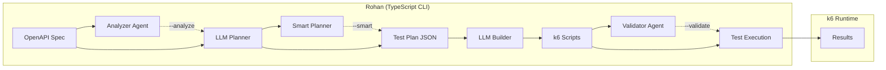

# Rohan

**OpenAPI Test Generator for k6**

Rohan is a CLI tool that automatically generates [k6](https://k6.io) test scripts from your OpenAPI specification using LLMs. It analyzes your API spec and produces production-ready JavaScript tests that you can run with k6.

## Features

- **Automatic Test Generation** - LLM analyzes your OpenAPI spec and generates intelligent test scenarios
- **k6 Compatible** - Outputs standard k6 JavaScript tests that work with k6's battle-tested runtime
- **Multiple LLM Providers** - Works with Groq, OpenAI, Anthropic, Together, Fireworks, and Ollama
- **Batching** - Efficient batch processing to reduce API calls and costs
- **E2E Workflows** - Generate multi-step end-to-end test scenarios
- **Smart Agents** - Optional subagents for validation, deep analysis, and intelligent coverage planning

## Smart Agents (AI-Powered Enhancement)

Rohan includes optional AI-powered subagents that enhance test generation quality and coverage:

| Agent | Flag | Description |
|-------|------|-------------|
| **Validator** | `--validate` | Validates generated k6 scripts with dry-run and auto-fixes syntax errors |
| **Analyzer** | `--analyze` | Deep analyzes OpenAPI specs to detect workflow patterns, auth flows, and relationships |
| **Smart Planner** | `--smart` | Prioritizes tests by criticality and calculates coverage metrics |

### Quick Examples

```bash
# Smart planning with coverage metrics
rohan plan api-spec.json --smart --target-coverage 90

# E2E with deep analysis
rohan plan api-spec.json --e2e --analyze

# Build with auto-validation and fixing
rohan build test-plan.json --validate --max-attempts 5

# Full pipeline: analyze → smart plan → build → validate
rohan plan api-spec.json --e2e --analyze --smart -o plan.json
rohan build plan.json --validate -o tests/
```

### What Each Agent Does

**🔍 Validator Agent** - Runs `k6 --dry-run` on each generated script. If errors are found, it uses the LLM to automatically fix the code and retries until valid or max attempts reached.

**🔬 Analyzer Agent** - Examines your OpenAPI spec to identify:
- CRUD patterns and resource lifecycles
- Authentication flows (login, token refresh, logout)
- State machines (draft → published → archived)
- Nested resource relationships

**🧠 Smart Planner** - Enhances test generation with:
- Priority levels (critical, high, medium, low)
- Test categories (happy_path, boundary, negative, security)
- Coverage metrics (endpoint, method, status code coverage)
- Sorted output with critical tests first

> **Note**: Smart agents require additional LLM calls. Use them when quality and coverage are more important than speed.

## Test Scenario Coverage

Rohan generates comprehensive test cases covering multiple scenario categories:

### Simple/Unit Test Scenarios

| Category | Description | Example Tests |
|----------|-------------|---------------|
| **Happy Path** | Valid requests with expected inputs | `Get_Users_Basic`, `Create_User_With_All_Fields` |
| **Boundary** | Edge values (min, max, zero, negative) | `Create_Message_Zero_Priority`, `Get_Message_Max_Timeout` |
| **Negative/Validation** | Invalid inputs that should fail | `Fail_Create_User_Missing_Email`, `Fail_Update_Invalid_JSON` |
| **Data Type Variations** | Different types for flexible fields | `Create_Message_String_Payload`, `Create_Message_Array_Payload` |
| **Edge Cases** | Unusual but valid inputs | `Create_User_Unicode_Name`, `Update_Message_Empty_String` |
| **Batch Operations** | Collection/array operations | `Create_Batch_Five_Messages`, `Fail_Batch_Not_An_Array` |
| **Security** | Injection and attack vectors | `Security_Create_SQL_Injection_Name`, `Security_Update_XSS_Field` |

### Integration/E2E Test Scenarios

| Category | Description | Example Tests |
|----------|-------------|---------------|
| **CRUD Lifecycle** | Full create → read → update → delete | `CRUD_User_Full_Lifecycle` |
| **State Verification** | Verify changes persist correctly | `Update_And_Verify_Persistence` |
| **Deletion Verification** | Verify 404 after delete | `Delete_Then_Verify_Not_Found` |
| **List Consistency** | Verify list reflects mutations | `Batch_Create_Then_List_Verify` |
| **Concurrent Access** | Race conditions and parallel access | `Concurrent_Update_Same_Resource` |
| **Idempotency** | Duplicate request handling | `Idempotency_Duplicate_POST_No_Duplicate` |

### Scenario Details

<details>
<summary><strong>Boundary & Edge Cases</strong></summary>

- Zero values (`priority: 0`, `timeout: 0`)
- Negative numbers (`maxAttempts: -1`)
- Maximum values (`timeout: 2147483647`)
- Minimum values (`retries: 1`)
- Decimal values for integer fields (`count: 1.5`)
- Empty strings, arrays, objects
- Very long strings (1000+ chars)
- Special characters and Unicode/Emoji

</details>

<details>
<summary><strong>Negative/Validation Tests</strong></summary>

- Missing required fields
- Wrong data types (`"priority": "high"` instead of number)
- Malformed JSON body
- Empty request body
- Out of range values
- Invalid enum values

</details>

<details>
<summary><strong>Security Tests</strong></summary>

- **SQL Injection**: `'; DROP TABLE users; --`
- **XSS**: `<script>alert('xss')</script>`
- **Path Traversal**: `../../etc/passwd`
- **Command Injection**: `; rm -rf /`
- **Integer Overflow**: Values exceeding max int

</details>

<details>
<summary><strong>E2E Workflow Tests</strong></summary>

- Create resource → Read → Verify data matches
- Update resource → Read → Verify changes saved
- Delete resource → Read → Verify 404 returned
- Batch create → List → Verify count matches
- Concurrent modifications → Verify consistency

</details>

## Quick Start

### Prerequisites

- **Node.js 20+** (for running Rohan)
- **k6** (for running generated tests)
- **An LLM API key** (Groq, OpenAI, Anthropic, etc.)

### Install k6

```bash
# Windows
choco install k6
# or
winget install k6

# macOS
brew install k6

# Linux (Debian/Ubuntu)
sudo gpg -k
sudo gpg --no-default-keyring --keyring /usr/share/keyrings/k6-archive-keyring.gpg --keyserver hkp://keyserver.ubuntu.com:80 --recv-keys C5AD17C747E3415A3642D57D77C6C491D6AC1D69
echo "deb [signed-by=/usr/share/keyrings/k6-archive-keyring.gpg] https://dl.k6.io/deb stable main" | sudo tee /etc/apt/sources.list.d/k6.list
sudo apt-get update
sudo apt-get install k6
```

See [k6 installation docs](https://k6.io/docs/get-started/installation/) for more options.

### Install Rohan

```bash
# Clone the repository
git clone https://github.com/yourusername/rohan.git
cd rohan

# Install dependencies
npm install

# Build
npm run build

# Run (from project directory)
npm run rohan -- --help
```

### Usage

Set your LLM provider's API key:

```bash
# For Groq (default)
export GROQ_API_KEY="your-groq-api-key"

# For OpenAI
export OPENAI_API_KEY="your-openai-api-key"

# For Anthropic
export ANTHROPIC_API_KEY="your-anthropic-api-key"
```

Generate tests and run them:

```bash
# Step 1: Generate test plan from OpenAPI spec
npm run rohan -- plan api-spec.json -o test-plan.json -w 5 --batch-size 5

# Step 2: Build k6 scripts from the plan
npm run rohan -- build test-plan.json -o tests/ -w 5 --batch-size 5

# Step 3: Run tests with k6
k6 run --env BASE_URL=http://localhost:8080 tests/test_get_users_basic.js

# Or run all tests
for f in tests/*.js; do k6 run --env BASE_URL=http://localhost:8080 "$f"; done
```

## Workflow

### Step 1: Generate Test Plan

```bash
npm run rohan -- plan api-spec.json -o test-plan.json -w 5
```

Creates a `test-plan.json` file containing test entries:

```json
{
  "version": "1.0",
  "api_title": "My API",
  "api_version": "1.0.0",
  "tests": [
    {
      "name": "Get_Users_Basic",
      "method": "GET",
      "path": "/users",
      "endpoint_spec": { ... }
    },
    {
      "name": "Create_User_Basic",
      "method": "POST",
      "path": "/users",
      "endpoint_spec": { ... }
    }
  ]
}
```

### Step 2: Build k6 Scripts

```bash
npm run rohan -- build test-plan.json -o tests/ -w 5
```

Generates k6-compatible JavaScript tests with descriptive filenames:

```
tests/
├── manifest.json
├── test_get_users_basic.js
├── test_create_user_basic.js
└── ...
```

By default, existing test files are **not overwritten**. Use `--overwrite` to replace them:

```bash
npm run rohan -- build test-plan.json -o tests/ --overwrite
```

Each test file is a complete k6 script:

```javascript
// Test: Get_Users_Basic
// Generated by Rohan

import http from 'k6/http';
import { check } from 'k6';

const BASE_URL = __ENV.BASE_URL || 'http://localhost:8080';

export default function() {
    const res = http.get(`${BASE_URL}/users`);
    check(res, {
        'status is 200': (r) => r.status === 200,
    });
}
```

### Step 3: Run with k6

```bash
# Run a single test
k6 run --env BASE_URL=http://localhost:8080 tests/test_get_users_basic.js

# Run all tests (bash/zsh)
for f in tests/*.js; do k6 run --env BASE_URL=http://localhost:8080 "$f"; done

# Run all tests (PowerShell)
Get-ChildItem tests\*.js | ForEach-Object { k6 run --env BASE_URL=http://localhost:8080 $_.FullName }

# Load test with 10 virtual users for 30 seconds
k6 run --env BASE_URL=http://localhost:8080 --vus 10 --duration 30s tests/test_get_users_basic.js
```

## CLI Reference

### Commands

| Command | Description |
|---------|-------------|
| `plan` | Generate test plan JSON from an OpenAPI spec |
| `build` | Build k6 test scripts from a test plan JSON file |
| `exec` | Show instructions for running tests with k6 |
| `validate` | Validate an OpenAPI specification |

### `plan` Command

```bash
npm run rohan -- plan <spec-path> [options]
```

| Flag | Type | Default | Description |
|------|------|---------|-------------|
| `-o`, `--output` | path | `test-plan.json` | Output file for the test plan |
| `-w`, `--workers` | int | 5 | Number of parallel LLM workers |
| `--model` | string | `llama-3.3-70b-versatile` | LLM model identifier |
| `--provider` | string | auto-detect | LLM provider (groq, openai, anthropic, together, fireworks, ollama) |
| `--api-base` | URL | auto-detected | Custom LLM API endpoint |
| `--batch-size` | int | 5 | Number of endpoints to batch per LLM request |
| `--rpm` | int | 0 | Max requests per minute (0 = unlimited) |
| `--e2e` | bool | false | Generate E2E workflow tests |
| `--verbose` | bool | false | Enable detailed logging |
| `--prompt-dir` | path | - | Custom prompt directory |
| `--smart` | bool | false | Enable smart coverage-aware planning |
| `--target-coverage` | int | 80 | Target coverage percentage (with --smart) |
| `--analyze` | bool | false | Deep analyze spec for E2E workflows (with --e2e) |

### `build` Command

```bash
npm run rohan -- build <plan-path> [options]
```

| Flag | Type | Default | Description |
|------|------|---------|-------------|
| `-o`, `--output` | path | `tests/` | Output directory for test scripts |
| `--overwrite` | bool | `false` | Overwrite existing test files |
| `-w`, `--workers` | int | 5 | Number of parallel LLM workers |
| `--model` | string | `llama-3.3-70b-versatile` | LLM model identifier |
| `--provider` | string | auto-detect | LLM provider |
| `--api-base` | URL | auto-detected | Custom LLM API endpoint |
| `--batch-size` | int | 5 | Number of tests to batch per LLM request |
| `--rpm` | int | 0 | Max requests per minute (0 = unlimited) |
| `--e2e` | bool | false | Build E2E workflow tests |
| `--verbose` | bool | false | Enable detailed logging |
| `--prompt-dir` | path | - | Custom prompt directory |
| `--validate` | bool | false | Validate scripts with k6 and auto-fix errors |
| `--max-attempts` | int | 3 | Max validation/fix attempts (with --validate) |

### `exec` Command

```bash
npm run rohan -- exec <tests-dir> [--target URL]
```

Shows instructions for running the generated tests with k6.

| Flag | Type | Default | Description |
|------|------|---------|-------------|
| `--target` | URL | `http://localhost:8080` | Base URL for example commands |

### `validate` Command

```bash
npm run rohan -- validate <spec-path>
```

Validates an OpenAPI specification file and shows basic info.

## LLM Providers

Rohan supports multiple LLM providers:

| Provider | Package | Env Variable | Example Models |
|----------|---------|--------------|----------------|
| Groq | `@ai-sdk/groq` | `GROQ_API_KEY` | `llama-3.3-70b-versatile` |
| OpenAI | `@ai-sdk/openai` | `OPENAI_API_KEY` | `gpt-4o`, `gpt-4o-mini` |
| Anthropic | `@ai-sdk/anthropic` | `ANTHROPIC_API_KEY` | `claude-sonnet-4-20250514` |
| Together | via OpenAI compat | `TOGETHER_API_KEY` | `meta-llama/Llama-3-70b-chat-hf` |
| Fireworks | via OpenAI compat | `FIREWORKS_API_KEY` | `llama-v3-70b-instruct` |
| Cloudflare | via OpenAI compat | `CLOUDFLARE_API_TOKEN` + `CLOUDFLARE_ACCOUNT_ID` | `@cf/deepseek-ai/deepseek-coder-6.7b-instruct-awq` |
| Ollama | via OpenAI compat | - | `qwen2.5-coder:7b` (recommended), `llama3` |

### Provider Examples

```bash
# Groq (default)
export GROQ_API_KEY="gsk_..."
npm run rohan -- plan api-spec.json --model llama-3.3-70b-versatile

# OpenAI
export OPENAI_API_KEY="sk-..."
npm run rohan -- plan api-spec.json --provider openai --model gpt-4o

# Anthropic
export ANTHROPIC_API_KEY="sk-ant-..."
npm run rohan -- plan api-spec.json --provider anthropic --model claude-sonnet-4-20250514

# Local Ollama (recommended for offline/free usage)
ollama pull qwen2.5-coder:7b  # First time only
npm run rohan -- plan api-spec.json --provider ollama --model qwen2.5-coder:7b

# Cloudflare Workers AI
export CLOUDFLARE_API_TOKEN="your-api-token"
export CLOUDFLARE_ACCOUNT_ID="your-account-id"
npm run rohan -- plan api-spec.json --provider cloudflare --model @cf/deepseek-ai/deepseek-coder-6.7b-instruct-awq
```

## Local LLM with Ollama (Free & Offline)

Run Rohan completely locally without API costs using Ollama and Qwen2.5-Coder.

### Why Use Local LLM?

| Benefit | Description |
|---------|-------------|
| **Zero Cost** | No API fees - runs entirely on your machine |
| **Offline** | Works without internet connection |
| **Privacy** | Your API specs never leave your machine |
| **Speed** | No network latency for API calls |

### Setup

#### 1. Install Ollama

```bash
# Windows
winget install Ollama.Ollama

# macOS
brew install ollama

# Linux
curl -fsSL https://ollama.com/install.sh | sh
```

#### 2. Pull Qwen2.5-Coder Model

```bash
ollama pull qwen2.5-coder:7b
```

Model specs:
- **Size**: ~4.7GB download
- **RAM**: ~6GB during inference
- **Context**: 32K tokens
- **Speed**: 10-20 tokens/sec on CPU

#### 3. Run Rohan with Local Model

```bash
# Generate test plan
npm run rohan -- plan api-spec.json -o test-plan.json --provider ollama --model qwen2.5-coder:7b

# Build k6 scripts
npm run rohan -- build test-plan.json -o tests/ --provider ollama --model qwen2.5-coder:7b
```

### Alternative Local Models

| Model | Size | Quality | Speed | Command |
|-------|------|---------|-------|---------|
| `qwen2.5-coder:7b` | 4.7GB | Best | Medium | `ollama pull qwen2.5-coder:7b` |
| `qwen2.5-coder:3b` | 2.0GB | Good | Fast | `ollama pull qwen2.5-coder:3b` |
| `deepseek-coder:6.7b` | 3.8GB | Very Good | Medium | `ollama pull deepseek-coder:6.7b` |
| `codellama:7b` | 3.8GB | Good | Medium | `ollama pull codellama:7b` |

### Hardware Requirements

| RAM | Recommended Model |
|-----|-------------------|
| 8GB | `qwen2.5-coder:3b` |
| 16GB | `qwen2.5-coder:7b` or `deepseek-coder:6.7b` |
| 32GB+ | Any model, comfortable headroom |

## Cloudflare Workers AI

Use Cloudflare Workers AI for fast, affordable inference with models like DeepSeek Coder.

### Why Use Cloudflare Workers AI?

| Benefit | Description |
|---------|-------------|
| **Fast Inference** | Global edge network for low latency |
| **Affordable** | Pay-per-use pricing, generous free tier |
| **AWQ Models** | Quantized models for faster inference |
| **No GPU Setup** | No hardware to manage |

### Setup

1. **Get your Cloudflare Account ID**: Dashboard → Workers & Pages → Account ID (right sidebar)

2. **Create an API Token**: My Profile → API Tokens → Create Token → Workers AI template

3. **Set environment variables**:
```bash
export CLOUDFLARE_API_TOKEN="your-api-token"
export CLOUDFLARE_ACCOUNT_ID="your-account-id"
```

4. **Run Rohan with Cloudflare**:
```bash
npm run rohan -- plan api-spec.json --provider cloudflare --model @cf/deepseek-ai/deepseek-coder-6.7b-instruct-awq
```

### Available Models

| Model | Best For |
|-------|----------|
| `@cf/deepseek-ai/deepseek-coder-6.7b-instruct-awq` | Code generation (recommended) |
| `@cf/meta/llama-3.1-8b-instruct` | General purpose |
| `@cf/meta/llama-3.1-70b-instruct` | Complex reasoning |
| `@cf/qwen/qwen1.5-14b-chat-awq` | Balanced performance |
| `@cf/mistral/mistral-7b-instruct-v0.2` | Fast, lightweight |

## Batching for Efficiency

Rohan supports batching multiple endpoints/tests per LLM request, which significantly reduces:

- **API calls**: 50 endpoints with batch size 5 = 10 requests instead of 50
- **Token consumption**: System prompts sent once per batch instead of once per item
- **Rate limit pressure**: Fewer requests means less chance of hitting rate limits

```bash
# Batch 10 endpoints per request during planning
npm run rohan -- plan api-spec.json --batch-size 10

# Batch 5 tests per request during building (default)
npm run rohan -- build test-plan.json --batch-size 5

# Disable batching (one item per request)
npm run rohan -- plan api-spec.json --batch-size 1
```

## Smart Agents

Rohan includes optional subagents that enhance test generation quality:

### Validator Agent (`--validate`)

Validates generated k6 scripts and automatically fixes syntax errors:

- Runs `k6 --dry-run` to check syntax
- Parses error messages
- Uses LLM to fix broken code
- Retries until valid or max attempts reached

**Usage:**
```bash
# Basic validation
rohan build test-plan.json --validate

# With more fix attempts
rohan build test-plan.json --validate --max-attempts 5

# With verbose output
rohan build test-plan.json --validate --verbose
```

**Output:**
```
🔍 Validating generated scripts...
✓ Get_Users_Basic - valid
✓ Create_User_Basic - fixed after 2 attempts
⚠ Delete_User_Invalid - could not fix (3 errors after 3 attempts)

🔍 Validation Summary
   ✓ Valid: 45
   🔧 Fixed: 3
   ✗ Failed: 2
```

### Analyzer Agent (`--analyze`)

Deep analyzes OpenAPI specs to detect complex patterns (use with `--e2e`):

- Identifies workflow patterns (CRUD, sagas, state machines)
- Detects authentication flows
- Maps resource relationships
- Provides enriched context to E2E planner

**Usage:**
```bash
# E2E with deep analysis
rohan plan api-spec.json --e2e --analyze

# With verbose output
rohan plan api-spec.json --e2e --analyze --verbose
```

**Output:**
```
🔬 Running deep analysis on OpenAPI spec...
✓ Analysis complete:
   📊 5 workflow patterns detected
   🔐 2 auth flows detected
   🔄 1 state machines detected
   🔗 3 resource relationships detected

   Top workflow patterns:
   • User_Registration_Flow (saga, critical)
   • Order_Lifecycle (state_machine, critical)
   • CRUD_Products (crud, high)
```

### Smart Planner Agent (`--smart`)

Generates prioritized test plans with coverage metrics:

- Calculates coverage for endpoints, methods, status codes
- Prioritizes tests (critical, high, medium, low)
- Categorizes tests (happy_path, boundary, negative, security)
- Reports coverage gaps

**Usage:**
```bash
# Smart planning with default 80% target
rohan plan api-spec.json --smart

# With custom coverage target
rohan plan api-spec.json --smart --target-coverage 90

# Combine with E2E analysis
rohan plan api-spec.json --e2e --analyze --smart
```

**Output:**
```
🧠 Smart Planning Mode
🎯 Target coverage: 85%

📊 Coverage Metrics
   Endpoint Coverage: 100%
   Method Coverage: 100%
   Status Code Coverage: 85%
   Parameter Coverage: 72%

   Tests by priority:
   • Critical: 12
   • High: 18
   • Medium: 8
   • Low: 4

✓ Generated 42 test entries with smart coverage
```

### Complete Pipeline Example

```bash
# Full pipeline with all agents
rohan plan api-spec.json --smart --target-coverage 90 -o plan.json
rohan build plan.json --validate --max-attempts 3 -o tests/

# E2E with deep analysis + validation
rohan plan api-spec.json --e2e --analyze -o e2e-plan.json
rohan build e2e-plan.json --e2e --validate -o tests/
```

## Prompt Customization

Prompts are stored in the `prompts/` directory. Override them with `--prompt-dir`:

```bash
npm run rohan -- plan api-spec.json --prompt-dir ./my-prompts/
```

| File | Purpose |
|------|---------|
| `planner_system.md` | System prompt for test scenario planning |
| `planner_user.md` | User prompt template for planning |
| `builder_system.md` | System prompt for JavaScript code generation |
| `builder_user.md` | User prompt template for code gen |
| `planner_batch_system.md` | System prompt for batched planning |
| `planner_batch_user.md` | User prompt for batched planning |
| `builder_batch_system.md` | System prompt for batched building |
| `builder_batch_user.md` | User prompt for batched building |
| `e2e_planner_system.md` | System prompt for E2E workflow planning |
| `e2e_planner_user.md` | User prompt for E2E planning |
| `e2e_builder_system.md` | System prompt for E2E script generation |
| `e2e_builder_user.md` | User prompt for E2E building |
| `agent_validator_system.md` | System prompt for script validation/fixing |
| `agent_validator_user.md` | User prompt for validation |
| `agent_analyzer_system.md` | System prompt for deep spec analysis |
| `agent_analyzer_user.md` | User prompt for analysis |
| `smart_planner_system.md` | System prompt for smart planning |
| `smart_planner_user.md` | User prompt for smart planning |

## Development

```bash
# Install dependencies
npm install

# Build TypeScript
npm run build

# Watch mode (rebuild on changes)
npm run dev

# Run tests
npm test

# Clean build artifacts
npm run clean
```

## Architecture



Rohan handles **test generation**, k6 handles **test execution**.

## Why k6?

k6 is the industry standard for API and load testing:

- **Performance** - Written in Go, handles thousands of virtual users
- **Scripting** - JavaScript/ES6 syntax that's easy to read and modify
- **Metrics** - Built-in latency percentiles, throughput, error rates
- **Integrations** - Grafana, InfluxDB, Prometheus, CI/CD systems
- **Extensions** - Browser testing, Kafka, Redis, SQL, and more

## License

MIT

---

**Rohan** - *LLM-powered test generation for k6*
