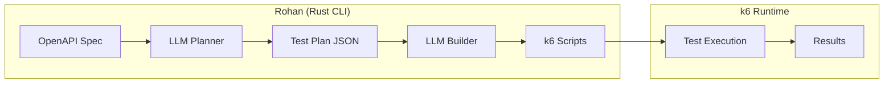

# Rohan

**OpenAPI Test Generator for k6**

Rohan is a CLI tool that automatically generates [k6](https://k6.io) test scripts from your OpenAPI specification using LLMs. It analyzes your API spec and produces production-ready JavaScript tests that you can run with k6.

## Features

- **Automatic Test Generation** - LLM analyzes your OpenAPI spec and generates intelligent test scenarios
- **k6 Compatible** - Outputs standard k6 JavaScript tests that work with k6's battle-tested runtime
- **Multiple LLM Providers** - Works with Groq, OpenAI, Anthropic, Together, and more
- **Two-Step Workflow** - Generate test plan first, review/edit, then build scripts

## Quick Start

### Prerequisites

- **Rust 1.70+** (for building from source)
- **k6** (for running generated tests)
- **An LLM API key** (Groq, OpenAI, Anthropic, etc.)

### Install k6

```bash
# Windows
choco install k6
# or
winget install k6

# macOS
brew install k6

# Linux (Debian/Ubuntu)
sudo gpg -k
sudo gpg --no-default-keyring --keyring /usr/share/keyrings/k6-archive-keyring.gpg --keyserver hkp://keyserver.ubuntu.com:80 --recv-keys C5AD17C747E3415A3642D57D77C6C491D6AC1D69
echo "deb [signed-by=/usr/share/keyrings/k6-archive-keyring.gpg] https://dl.k6.io/deb stable main" | sudo tee /etc/apt/sources.list.d/k6.list
sudo apt-get update
sudo apt-get install k6
```

See [k6 installation docs](https://k6.io/docs/get-started/installation/) for more options.

### Install Rohan

```bash
# Clone the repository
git clone https://github.com/yourusername/rohan.git
cd rohan

# Build in release mode
cargo build --release

# The binary will be at ./target/release/rohan
```

### Usage

Set your LLM provider's API key:

```bash
# For Groq (default)
export GROQ_API_KEY="your-groq-api-key"

# For OpenAI
export OPENAI_API_KEY="your-openai-api-key"

# For Anthropic
export ANTHROPIC_API_KEY="your-anthropic-api-key"
```

Generate tests and run them:

```bash
# Step 1: Generate test plan from OpenAPI spec
rohan plan api-spec.json -o test-plan.json -w 1 --rps 3

# Step 2: Build k6 scripts from the plan
rohan build test-plan.json -o tests/ -w 1 --rps 5

# Step 3: Run tests with k6
k6 run --env BASE_URL=http://localhost:8080 tests/test_1.js

# Or run all tests
for f in tests/*.js; do k6 run --env BASE_URL=http://localhost:8080 "$f"; done
```

## Workflow

### Step 1: Generate Test Plan

```bash
rohan plan api-spec.json -o test-plan.json -w 5
```

Creates a `test-plan.json` file containing test entries:

```json
{
  "version": "1.0",
  "api_title": "My API",
  "api_version": "1.0.0",
  "tests": [
    {
      "name": "Get_Users_Basic",
      "method": "GET",
      "path": "/users",
      "endpoint_spec": { ... }
    },
    {
      "name": "Create_User_Basic",
      "method": "POST",
      "path": "/users",
      "endpoint_spec": { ... }
    }
  ]
}
```

### Step 2: Build k6 Scripts

```bash
rohan build test-plan.json -o tests/ -w 5
```

Generates k6-compatible JavaScript tests:

```
tests/
├── manifest.json
├── test_1.js    # Get_Users_Basic
├── test_2.js    # Create_User_Basic
└── ...
```

Each test file is a complete k6 script:

```javascript
// Test: Get_Users_Basic
// Generated by Rohan

import http from 'k6/http';
import { check } from 'k6';

const BASE_URL = __ENV.BASE_URL || 'http://localhost:8080';

export default function() {
    const res = http.get(`${BASE_URL}/users`);
    check(res, {
        'status is 200': (r) => r.status === 200,
    });
}
```

### Step 3: Run with k6

```bash
# Run a single test
k6 run --env BASE_URL=http://localhost:8080 tests/test_1.js

# Run all tests (bash/zsh)
for f in tests/*.js; do k6 run --env BASE_URL=http://localhost:8080 "$f"; done

# Run all tests (PowerShell)
Get-ChildItem tests\*.js | ForEach-Object { k6 run --env BASE_URL=http://localhost:8080 $_.FullName }

# Load test with 10 virtual users for 30 seconds
k6 run --env BASE_URL=http://localhost:8080 --vus 10 --duration 30s tests/test_1.js
```

## CLI Reference

### Commands

| Command | Description |
|---------|-------------|
| `plan` | Generate test plan JSON from an OpenAPI spec |
| `build` | Build k6 test scripts from a test plan JSON file |
| `exec` | Show instructions for running tests with k6 |
| `validate` | Validate an OpenAPI specification |

### `plan` Command

```bash
rohan plan <spec-path> [options]
```

| Flag | Type | Default | Description |
|------|------|---------|-------------|
| `-o`, `--output` | path | `test-plan.json` | Output file for the test plan |
| `-w`, `--workers` | int | 5 | Number of parallel LLM workers |
| `--model` | string | `llama3-70b-8192` | LLM model identifier |
| `--api-base` | URL | auto-detected | Custom LLM API endpoint |
| `--rps` | int | 0 | Max requests per second (0 = unlimited) |

### `build` Command

```bash
rohan build <plan-path> [options]
```

| Flag | Type | Default | Description |
|------|------|---------|-------------|
| `-o`, `--output` | path | `tests/` | Output directory for test scripts |
| `-w`, `--workers` | int | 5 | Number of parallel LLM workers |
| `--model` | string | `llama3-70b-8192` | LLM model identifier |
| `--api-base` | URL | auto-detected | Custom LLM API endpoint |
| `--rps` | int | 0 | Max requests per second (0 = unlimited) |

### `exec` Command

```bash
rohan exec <tests-dir> [--target URL]
```

Shows instructions for running the generated tests with k6.

| Flag | Type | Default | Description |
|------|------|---------|-------------|
| `--target` | URL | `http://localhost:8080` | Base URL for example commands |

## Test Naming Convention

The test names in the plan guide the LLM to generate appropriate test code:

| Pattern | Meaning |
|---------|---------|
| `Create_*` / `Post_*` | POST request, expect 201 |
| `Get_*` | GET request, expect 200 |
| `Update_*` | PUT/PATCH request, expect 200 |
| `Delete_*` | DELETE request, expect 200/204 |
| `Fail_*` | Expects an error response (4xx) |
| `*_String_Payload` | Use string value in payload |
| `*_Missing_*` | Omit a required field |
| `*_Zero_*` | Use 0 for a numeric field |
| `*_Empty_*` | Use empty string/array/object |

## Environment Variables

### LLM Provider Keys

| Variable | Provider |
|----------|----------|
| `GROQ_API_KEY` | Groq (default) |
| `OPENAI_API_KEY` | OpenAI |
| `ANTHROPIC_API_KEY` | Anthropic |
| `TOGETHER_API_KEY` | Together AI |

### Configuration

| Variable | Description |
|----------|-------------|
| `ROHAN_MODEL` | Default LLM model |
| `ROHAN_API_BASE` | Custom API endpoint |
| `ROHAN_RPS` | Default max requests per second |
| `ROHAN_PROMPT_DIR` | Custom prompt directory |

## Architecture



Rohan handles **test generation**, k6 handles **test execution**. This separation gives you:

- **Battle-tested execution** - k6 is used by thousands of companies
- **Rich k6 features** - Thresholds, scenarios, protocols, extensions
- **Flexibility** - Edit generated scripts, add custom logic
- **Load testing** - Use k6's load testing capabilities out of the box

## Why k6?

k6 is the industry standard for API and load testing:

- **Performance** - Written in Go, handles thousands of virtual users
- **Scripting** - JavaScript/ES6 syntax that's easy to read and modify
- **Metrics** - Built-in latency percentiles, throughput, error rates
- **Integrations** - Grafana, InfluxDB, Prometheus, CI/CD systems
- **Extensions** - Browser testing, Kafka, Redis, SQL, and more

## License

MIT

---

**Rohan** - *LLM-powered test generation for k6*
