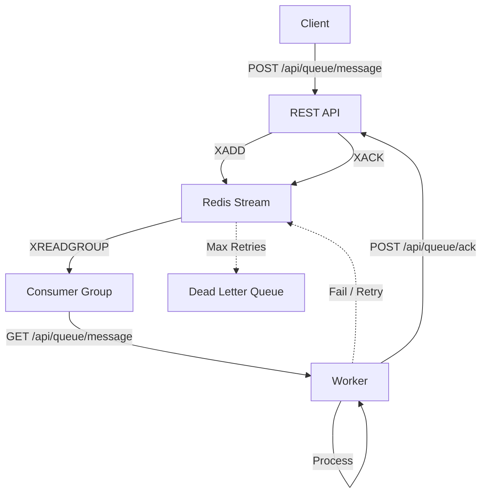

# Relay

> **A lightweight, language-agnostic message broker built on native Redis Streams.**

Most queue libraries lock you into a specific language ecosystem. Relay provides a standard protocol over Redis Streams, allowing you to produce messages in one language (e.g., Node.js API) and consume them in another (e.g., Python/Go Worker) with zero friction. It handles the heavy lifting of Consumer Groups, Acknowledgments, and Dead Letter Queues (DLQ) without the bloat.

---

## 🎯 The "Polyglot" Problem

**The Problem:** Existing queue libraries are excellent within their own language (BullMQ for Node, Celery for Python, Sidekiq for Ruby), but they make it very hard to mix languages. If you want a Node.js API to send jobs to a Python AI worker, those libraries are painful.

**This Solution:** Relay provides a **REST API** built on Native Redis Streams. Any language that can make HTTP requests can produce or consume messages—no language-specific SDKs required. Your Node.js API sends messages via HTTP, your Python worker consumes via HTTP, your Go service monitors via HTTP. Simple, standard, and truly polyglot.

---

## 📊 How It Compares

| Feature | Relay | BullMQ / Sidekiq / Celery | Raw Redis Lists (RPOP) |
|---------|-------------|---------------------------|------------------------|
| **Primary Goal** | Polyglot Compatibility | Language-Specific Features | Basic FIFO Queue |
| **Architecture** | Redis Streams (Consumer Groups) | Proprietary Lua Scripts / Lists | Simple Lists |
| **Worker Language** | **Any** (Python, Go, Node, etc.) | Locked (Node only, or Ruby only) | Any |
| **Reliability** | High (Atomic "Pending" state) | High | Low (Lost if worker crashes) |
| **Complexity** | Low (Thin Wrapper) | High (Heavy dependencies) | High (Manual safety logic) |
| **DLQ Logic** | Built-in | Built-in | Manual Implementation |
| **Infrastructure** | Redis (you probably have it) | Redis + Framework | Redis only |

---

## 🔍 Detailed Comparisons

### vs. BullMQ / Celery / Sidekiq

**The Problem with them:** These are "heavy" frameworks. If you use BullMQ, your workers must be Node.js. If you want a Python worker, you have to find a Python port of BullMQ (which might be outdated) or rewrite your worker.

**This Solution:** Relay uses Native Redis Streams under the hood. It doesn't use custom Lua scripts that hide logic. This means a producer in Go and a worker in Python see the exact same standard Redis data, accessed through a simple REST API.

### vs. RabbitMQ / Kafka

**The Problem with them:** They require setting up entirely new infrastructure. They are complex to maintain and often overkill for simple use cases.

**This Solution:** You probably already have Redis. Relay gives you Kafka-like reliability (Consumer Groups, Replay, Acknowledgements) using your existing Redis instance.

### vs. Raw Redis (LPUSH/RPOP)

**The Problem with them:** The naive approach (RPOPLPUSH) is dangerous. If a worker takes a job and crashes before finishing, that message is gone forever.

**This Solution:** We use Consumer Groups. When a worker takes a job, it enters a "Pending" state in Redis. If the worker crashes, the job is not lost—it sits there waiting to be reclaimed by another worker.

---

## ✨ Key Features

✅ **Atomic Locking**: Uses `XREADGROUP` to ensure a message is processed by only one worker at a time.

✅ **Crash Proof**: Messages are not removed until explicitly Acknowledged (`XACK`). If a worker crashes, messages automatically return to the queue.

✅ **Dead Letter Queue (DLQ)**: Automatically moves "poison pill" messages to a separate stream after N failures.

✅ **Zero-Config Persistence**: Leverages Redis AOF/RDB for data safety.

✅ **Priority Queues**: Support for 10 priority levels (0-9). Higher priority messages are processed first.

✅ **Built-in Retry Logic**: Failed messages are automatically retried with configurable attempts.

✅ **Split Brain Prevention**: Heartbeat/Touch endpoint prevents duplicate processing when workers are slow but not dead. Lock validation ensures stale ACKs are rejected.

✅ **Mission Control Dashboard**: Read/write GUI for inspecting and fixing live jobs.

✅ **Standard Protocol**: Any Redis GUI (like RedisInsight) can visualize your queues instantly because they are just standard Streams.

---

## 🚀 The "Polyglot" Power

### Produce in Node.js:

```javascript
// Node.js API Server
const response = await fetch('http://localhost:3000/api/queue/message', {
  method: 'POST',
  headers: { 
    'Content-Type': 'application/json',
    'X-API-KEY': process.env.SECRET_KEY  // Required if SECRET_KEY is set on server
  },
  body: JSON.stringify({
    type: 'video_transcode',
    payload: { file: 'movie.mp4', quality: '1080p' },
    priority: 1
  })
});
```

### Consume in Python:

```python
# Python Worker
import requests
import os

API_URL = 'http://localhost:3000/api/queue'
HEADERS = {'X-API-KEY': os.environ.get('SECRET_KEY', '')}

while True:
    # Get a message (blocks for up to 30 seconds)
    response = requests.get(f'{API_URL}/message', params={'timeout': 30}, headers=HEADERS)
    
    if response.status_code == 200:
        message = response.json()
        print(f"Processing: {message['payload']['file']}")
        
        # Process video...
        process_video(message['payload'])
        
        # Acknowledge
        requests.post(f'{API_URL}/ack', headers=HEADERS, json={
            'id': message['id'],
            '_stream_id': message['_stream_id'],
            '_stream_name': message['_stream_name']
        })
    elif response.status_code == 404:
        # No messages available
        continue
```

### Consume in Go:

```go
// Go Worker
package main

import (
    "bytes"
    "encoding/json"
    "io"
    "net/http"
    "os"
    "time"
)

func main() {
    apiURL := "http://localhost:3000/api/queue"
    apiKey := os.Getenv("SECRET_KEY")
    
    for {
        // Get a message
        req, _ := http.NewRequest("GET", apiURL+"/message?timeout=30", nil)
        req.Header.Set("X-API-KEY", apiKey)
        resp, _ := http.DefaultClient.Do(req)
        
        if resp.StatusCode == 200 {
            body, _ := io.ReadAll(resp.Body)
            var message map[string]interface{}
            json.Unmarshal(body, &message)
            
            // Process...
            processVideo(message["payload"])
            
            // Acknowledge
            ackData, _ := json.Marshal(map[string]interface{}{
                "id":          message["id"],
                "_stream_id":   message["_stream_id"],
                "_stream_name": message["_stream_name"],
            })
            ackReq, _ := http.NewRequest("POST", apiURL+"/ack", bytes.NewBuffer(ackData))
            ackReq.Header.Set("Content-Type", "application/json")
            ackReq.Header.Set("X-API-KEY", apiKey)
            http.DefaultClient.Do(ackReq)
        }
        
        time.Sleep(1 * time.Second)
    }
}
```

**The Magic:** All three languages use the same REST API. No language-specific SDKs, no direct Redis connections—just standard HTTP requests that any language can make.

---

## 📦 Installation

1. Clone the repository:

```bash
git clone https://github.com/mood-agency/relay.git
cd relay
```

2. Install dependencies:

```bash
pnpm install
# or
bun install
```

3. Start a Redis instance (Docker recommended):

```bash
docker run -d --name redis-stack -p 6379:6379 -p 8001:8001 redis/redis-stack:latest
```

This starts Redis on port 6379 and RedisInsight on port 8001 (optional, for viewing data).

4. Configure environment variables:

Create a `.env` file:

```ini
REDIS_HOST=localhost
REDIS_PORT=6379
REDIS_PASSWORD=
QUEUE_NAME=queue
ACK_TIMEOUT_SECONDS=30
MAX_ATTEMPTS=3
```

5. Run the application:

```bash
# Development mode: Run API and Dashboard together (with hot-reloading)
pnpm run dev:all

# Production mode: Build and start
pnpm run build
pnpm start
```

The API will be available at `http://localhost:3001` and the Dashboard at `http://localhost:3001/dashboard`.

---

## 🎮 Quick Start

### Using the REST API

**Add a message:**

```bash
curl -X POST http://localhost:3000/api/queue/message \
  -H "Content-Type: application/json" \
  -d '{
    "type": "email_send",
    "payload": {
      "to": "user@example.com",
      "subject": "Welcome!"
    },
    "priority": 0
  }'
```

**Get a message:**

```bash
curl "http://localhost:3000/api/queue/message?timeout=30"
```

**Acknowledge a message:**

```bash
curl -X POST http://localhost:3000/api/queue/ack \
  -H "Content-Type: application/json" \
  -d '{
    "id": "message-id-here",
    "_stream_id": "stream-id-here",
    "_stream_name": "queue"
  }'
```

---

## 🏗️ Architecture Overview

Relay implements a **reliable message queue system** using **Redis Streams** to ensure message durability, at-least-once delivery, and consumer groups for scaling.

### Redis Data Structures

The queue uses Redis Streams and Hash structures consistently across all queues:

1. **`queue`**, **`queue_p1`** ... **`queue_p9`** - **Priority Streams (10 levels)**
   - Stores messages with unique IDs generated by Redis
   - Supports Consumer Groups for parallel processing
   - Messages are added via `XADD` to the appropriate priority stream
   - Messages are read via `XREADGROUP` (highest priority streams checked first)
   - Priority 0 = `queue` (lowest), Priority 9 = `queue_p9` (highest)
   - Processing messages are tracked in the Pending Entries List (PEL) of these streams

2. **`queue_dlq`** - **Dead Letter Queue (Stream)**
   - Stores messages that failed after maximum retry attempts
   - Useful for debugging and manual intervention

3. **`queue_acknowledged`** - **Acknowledged Queue (Stream)**
   - Stores successfully processed messages for history/audit
   - Uses `XTRIM` with `MAXLEN` for automatic size limiting
   - Consistent with other queues for easier querying and management

4. **`queue_metadata`** - **Metadata Hash**
   - Stores additional message metadata (attempt counts, errors) not directly stored in the stream message body
   - Key-value pairs with message ID as key

### Message Lifecycle



### Message Format

```json
{
  "id": "uuid-here",           // Auto-generated if not provided
  "type": "string",            // Required: Message type identifier
  "payload": {},               // Optional: Message data (any JSON)
  "priority": 0,              // Optional: Priority level 0-9 (higher = processed first)
  "created_at": 1234567890    // Auto-generated timestamp
}
```

**Priority Levels:**
- `0` = Lowest priority (default)
- `1-8` = Intermediate priorities
- `9` = Highest priority (processed first)

### Visibility Timeout & Split Brain Prevention

**The Problem: "Slow Worker" vs "Dead Worker"**

Consider this scenario with a 30-second ACK timeout:

1. Worker A takes Message #1 and starts processing
2. The task is heavy and takes 40 seconds (longer than timeout)
3. At 30s, the system thinks Worker A is dead and re-queues Message #1
4. Worker B sees Message #1 in the queue and takes it
5. **Result**: Both A and B are now processing the same message (Split Brain)
6. At 40s, Worker A finishes and sends ACK
7. **Danger**: If the ACK is accepted, it could corrupt data or cause duplicate side effects

**The Solution: Touch Endpoint + Lock Validation**

Relay provides two mechanisms to prevent this:

1. **Touch/Heartbeat Endpoint** (`PUT /queue/message/:id/touch`)
   - Workers can extend their lock before timeout expires
   - Resets the visibility timeout without releasing the message

2. **Lock Validation (Fencing Token)**
   - Each dequeue generates a unique `lock_token` (random string)
   - ACK and touch requests must include `lock_token` for validation
   - If the message was re-queued and picked up by another worker, `lock_token` won't match → Request rejected with 409
   - `attempt_count` is kept separate for retry tracking (business logic)

**Example: Safe Processing of Heavy Tasks**

```python
import requests
import time
import threading

API_URL = 'http://localhost:3000/api/queue'
HEADERS = {'X-API-KEY': 'your-key'}

def process_with_heartbeat(message):
    """Process a message with periodic heartbeats to prevent timeout."""
    message_id = message['id']
    lock_token = message['lock_token']  # Unique token for this dequeue
    stop_heartbeat = threading.Event()
    lock_lost = threading.Event()
    
    def send_heartbeats():
        """Send touch requests every 20 seconds to extend the lock."""
        while not stop_heartbeat.is_set():
            time.sleep(20)  # Send heartbeat before 30s timeout
            if stop_heartbeat.is_set():
                break
            response = requests.put(
                f'{API_URL}/message/{message_id}/touch',
                headers=HEADERS,
                json={'lock_token': lock_token}
            )
            if response.status_code == 409:
                print(f"Lock lost for {message_id}! Another worker took over.")
                lock_lost.set()
                stop_heartbeat.set()
                return
            print(f"Lock extended for {message_id}")
    
    # Start heartbeat thread
    heartbeat_thread = threading.Thread(target=send_heartbeats)
    heartbeat_thread.start()
    
    try:
        # Simulate heavy processing (e.g., video transcoding, ML inference)
        result = process_heavy_task(message['payload'])  # Takes 2 minutes
        
        # Check if lock was lost during processing
        if lock_lost.is_set():
            print(f"Lock was lost - discarding work for {message_id}")
            return
        
        # Acknowledge with lock token validation
        response = requests.post(
            f'{API_URL}/ack',
            headers=HEADERS,
            json={
                'id': message_id,
                '_stream_id': message['_stream_id'],
                '_stream_name': message['_stream_name'],
                'lock_token': lock_token  # Fencing token validation
            }
        )
        
        if response.status_code == 409:
            print(f"ACK rejected - lock was lost. Work discarded.")
        else:
            print(f"Message {message_id} processed successfully!")
            
    finally:
        stop_heartbeat.set()
        heartbeat_thread.join()
```

**Why This Matters**

| Scenario | Without Protection | With Touch + Lock Validation |
|----------|-------------------|------------------------------|
| Worker slow but alive | Duplicate processing | Worker extends lock via touch |
| Worker crashed | Message re-queued ✓ | Message re-queued ✓ |
| Stale ACK from revived worker | Accepted (data corruption!) | Rejected with 409 |

### Configuration

- **ACK_TIMEOUT_SECONDS**: `30` - Time before a message in the Pending Entries List (PEL) is considered stalled
- **MAX_ATTEMPTS**: `3` - Maximum retry attempts before moving to dead letter queue
- **BATCH_SIZE**: `100` - Maximum messages processed in batch operations
- **MAX_PRIORITY_LEVELS**: `10` - Number of priority levels (0 to N-1, default 10 = priorities 0-9)

---

## 📡 API Endpoints

### 📖 API Documentation

This API includes a fully interactive documentation UI (Scalar) and a raw OpenAPI specification.

- **Interactive UI**: `http://localhost:3000/api/reference`
- **OpenAPI Spec (JSON)**: `http://localhost:3000/api/doc`

### Queue Operations

- `POST /api/queue/message` - Add a message to the queue
- `GET /api/queue/message?timeout=30` - Get a message from the queue
- `POST /api/queue/ack` - Acknowledge message processing
- `POST /api/queue/batch` - Add multiple messages at once
- `PUT /api/queue/message/:id/touch` - Extend message lock (heartbeat/keep-alive)
- `POST /api/queue/message/:id/nack` - Negative acknowledge (reject and requeue message)

### Monitoring

- `GET /api/health` - Health check endpoint
- `GET /api/queue/metrics` - Queue statistics and metrics
- `GET /api/queue/status` - Get detailed status of all queues with messages
- `GET /api/queue/messages?startTimestamp&endTimestamp` - Get messages by date range
- `DELETE /api/queue/messages?startTimestamp&endTimestamp` - Remove messages by date range

---

## 🎛️ Mission Control Dashboard

Don't just watch your queue. Manage it.

Most queues are "black boxes": you push a message and hope it works. This API ships with an integrated dashboard that gives you observability and control over your Redis Streams in real time, so Ops can fix stuck jobs without writing one-off scripts.

### Accessing the Dashboard

- **URL**: `http://localhost:3000/dashboard`
- **Root redirect**: `http://localhost:3000/` automatically redirects to dashboard

### The Debugging Superpowers

#### 🔍 Deep Filtering (Find the needle in the haystack)

- Filter by stage: queued (main), processing, dead (DLQ), acknowledged
- Filter by priority and attempts to find starving or repeatedly failing jobs
- Search by ID and filter by date range to locate specific transactions fast

#### 🔄 State Management (Force transitions)

- Edit the payload data inline.
- Move the message to a different stage (main, processing, dead, acknowledged).
- Create a new message with payload, type, priority and attempts number.
- Adjust the priority of a message.

### Dashboard Features

- **📊 Real-time statistics**: queued, processing, dead, acknowledged, archived
- **🧭 Server-side pagination & sorting**: browse large queues without loading everything
- **🧪 Safe operations via API**: actions go through validation instead of raw Redis edits
- **🔄 Real-time updates**: instant refreshes via Server-Sent Events (SSE)

### Why this beats generic Redis tools

| Feature | Mission Control Dashboard | RedisInsight (generic) | BullMQ / Sidekiq UI |
|---|---|---|---|
| Context | Job lifecycle, retries, errors | Raw keys/streams | Good, but language-locked |
| Editing | JSON + state transitions | Raw string edits | Often read-only or paid features |
| Search | Multi-criteria (stage + type + date + attempts) | Key scanning | Limited filtering |
| Safety | API-validated actions | No validation | Safe |

### Powered by the Node.js API (not direct Redis access)

The dashboard talks to the Node.js API; it does not connect to Redis directly. Redis credentials stay on the server, and the UI uses the same endpoints your workers use.

### 🚨 Anomaly Detection

The activity log automatically detects and flags unusual patterns in your queue operations. Anomalies are classified by severity:

| Anomaly | Severity | Description |
|---------|----------|-------------|
| **flash_message** | `info` | Message was dequeued extremely quickly (< 2s by default). May indicate a hot loop or test traffic. |
| **zombie_message** | `warning` | Message sat in the queue for hours before being picked up. May indicate consumer scaling issues. |
| **near_dlq** | `warning` | Message has only 1-2 attempts remaining before moving to the Dead Letter Queue. |
| **dlq_movement** | `critical` | Message was moved to the Dead Letter Queue after exhausting all retry attempts. |
| **long_processing** | `warning` | Message processing took significantly longer than the average (2x the expected time). |
| **lock_stolen** | `critical` | A message's lock token changed mid-processing, indicating another worker took over (split-brain scenario). |
| **burst_dequeue** | `warning` | A single consumer dequeued 10+ messages within 5 seconds. May indicate runaway consumer or hot partition. |
| **bulk_delete** | `warning` | A bulk delete operation removed many messages at once. |
| **bulk_move** | `info` | A bulk move operation transferred many messages between queues. |
| **queue_cleared** | `critical` | An entire queue was cleared. This is a destructive operation that should be audited. |
| **large_payload** | `warning` | Message payload exceeds the size threshold (100KB by default). Large payloads can impact performance. |

#### Configuring Anomaly Thresholds

You can tune anomaly detection via environment variables:

```bash
# Activity Log Settings
ACTIVITY_LOG_ENABLED=true              # Enable/disable activity logging
ACTIVITY_LOG_MAX_ENTRIES=50000         # Max entries before trimming
ACTIVITY_LOG_RETENTION_HOURS=24        # How long to keep logs

# Anomaly Thresholds
ACTIVITY_FLASH_MESSAGE_THRESHOLD_MS=2000       # Flash message threshold (ms)
ACTIVITY_ZOMBIE_MESSAGE_THRESHOLD_HOURS=1      # Zombie message threshold (hours)
ACTIVITY_BURST_THRESHOLD_COUNT=10              # Burst detection count
ACTIVITY_BURST_THRESHOLD_SECONDS=5             # Burst detection window (seconds)
ACTIVITY_LONG_PROCESSING_MULTIPLIER=2          # Multiplier for long processing detection
ACTIVITY_LARGE_PAYLOAD_BYTES=102400            # Large payload threshold (bytes)
ACTIVITY_BULK_OPERATION_THRESHOLD=10           # Bulk operation threshold
```

#### Using Anomaly Data

**Via Dashboard:** The Anomalies tab shows all detected anomalies with filtering by severity.

**Via API:**
```bash
# Get all anomalies
curl "http://localhost:3000/api/queue/activity/anomalies"

# Filter by severity
curl "http://localhost:3000/api/queue/activity/anomalies?severity=critical"

# Get full message history including anomalies
curl "http://localhost:3000/api/queue/activity/message/{messageId}"
```

### Testing the Dashboard

Use the included TypeScript script to populate the dashboard with sample data:

```bash
# Run the dashboard demo (uses SECRET_KEY from environment)
SECRET_KEY=your-key npx tsx test_dashboard.ts

# Or pass the API key directly
npx tsx test_dashboard.ts --api-key your-secret-key

# Add custom number of messages
npx tsx test_dashboard.ts --api-key your-key --messages 25

# Use different server URL
npx tsx test_dashboard.ts --api-key your-key --url http://localhost:8080
```

---

## 🧪 Running Tests

To run the integration tests for the queue API:

```bash
npm test src/routes/queue/queue.test.ts
```

This runs the Vitest suite covering:
- Health checks
- Enqueuing and dequeuing messages
- Message acknowledgment (with Redis Streams support)
- Error handling and invalid requests

---

## ⚙️ Environment Variables

You can customize queue behavior via environment variables:

```bash
# Redis Connection
REDIS_HOST=localhost
REDIS_PORT=6379
REDIS_PASSWORD=
REDIS_DB=0

# Queue Names (optional - defaults provided)
QUEUE_NAME=queue
PROCESSING_QUEUE_NAME=queue_processing
DEAD_LETTER_QUEUE_NAME=queue_dlq
METADATA_HASH_NAME=queue_metadata

# Queue Configuration
ACK_TIMEOUT_SECONDS=30
MAX_ATTEMPTS=3
BATCH_SIZE=100
MAX_PRIORITY_LEVELS=10  # Number of priority levels (0 to N-1)

# API Security (optional)
SECRET_KEY=your-secret-key-here  # If set, all API requests require X-API-KEY header

# Activity Log & Anomaly Detection (optional)
ACTIVITY_LOG_ENABLED=true
ACTIVITY_LOG_MAX_ENTRIES=50000
ACTIVITY_LOG_RETENTION_HOURS=24
```

### Dashboard Environment Variables

For the dashboard UI, create a `.env` file in the `dashboard-ui/` directory:

```bash
# Dashboard API Key (for authenticating with the backend)
VITE_API_KEY=your-secret-key-here
```

This key should match the `SECRET_KEY` configured on the server.

---

## 🔐 API Authentication

When `SECRET_KEY` is set, all API endpoints (except `/health` and `/queue/events`) require authentication via the `X-API-KEY` header.

### Authenticated Requests

```bash
# Add a message with authentication
curl -X POST http://localhost:3000/api/queue/message \
  -H "Content-Type: application/json" \
  -H "X-API-KEY: your-secret-key-here" \
  -d '{
    "type": "email_send",
    "payload": { "to": "user@example.com" }
  }'
```

### Python Example with Auth

```python
import requests

API_URL = 'http://localhost:3000/api/queue'
API_KEY = 'your-secret-key-here'

headers = {
    'Content-Type': 'application/json',
    'X-API-KEY': API_KEY
}

# Get a message
response = requests.get(f'{API_URL}/message', headers=headers)
```

### Dashboard Authentication

The dashboard supports two ways to configure the API key:

1. **Environment Variable (Build-time)**: Set `VITE_API_KEY` in `dashboard-ui/.env`
2. **Runtime Configuration**: Click the 🔑 key icon in the dashboard toolbar to enter the API key (stored in localStorage)

---

## 📝 Available Scripts

- `pnpm run dev` - Starts the application in development mode with hot-reloading
- `bun run dev:bun` - Starts the application with Bun (development mode)
- `pnpm run build` - Compiles the TypeScript code
- `pnpm start` - Builds and starts the application in production mode
- `bun run start:bun` - Starts the application with Bun (production mode)
- `pnpm test` - Runs the test suite
- `bun run test:bun` - Runs tests with Bun
- `pnpm dashboard:dev` - Starts the dashboard UI in development mode
- `bun run dashboard:dev:bun` - Starts the dashboard UI with Bun
- `pnpm dashboard:build` - Builds the dashboard UI for production
- `bun run dashboard:build:bun` - Builds the dashboard UI with Bun

---

## 🎓 Why This Approach?

### Don't Compete on Features

We won't beat BullMQ on plugins. We won't beat Kafka on throughput. We won't beat RabbitMQ on routing complexity.

### Compete on Flexibility

We are the **bridge between languages**. Your Node.js API can send messages to Python AI workers, Go image processors, or Ruby email senders—all using the same REST API.

### Compete on Simplicity

We are **closer to the metal** (Redis Streams) than the heavy frameworks. No hidden Lua scripts, no magic—just standard Redis Streams accessed through a simple REST API that any developer can understand and debug.

---

## 🤝 Contributing

Contributions are welcome! Please feel free to submit a Pull Request.

---

## 📄 License

MIT

---

## 🙏 Acknowledgments

Built with:
- [Hono](https://hono.dev/) - Fast web framework
- [ioredis](https://github.com/redis/ioredis) - Redis client
- [Redis Streams](https://redis.io/docs/data-types/streams/) - Native Redis data structure
- [Scalar](https://scalar.com/) - Beautiful API documentation
- [zod-openapi](https://github.com/honojs/middleware/tree/main/packages/zod-openapi) - OpenAPI generator
- [Shadcn UI](https://ui.shadcn.com/) - Beautiful UI components
- [Tailwind CSS](https://tailwindcss.com/) - Utility-first CSS framework
- [Vite](https://vite.dev/) - Fast development tool
- [TypeScript](https://www.typescriptlang.org/) - Typed JavaScript
- [pnpm](https://pnpm.io/) - Fast, disk space efficient package manager
- [Bun](https://bun.sh/) - Fast, all-in-one JavaScript runtime

---

**Ready to break free from language-specific queue libraries?** 🚀
