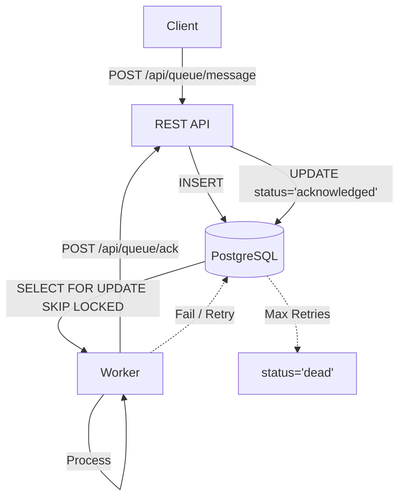

# Relay

> **A lightweight, language-agnostic message broker built on PostgreSQL.**

Most queue libraries lock you into a specific language ecosystem. Relay provides a standard protocol over PostgreSQL, allowing you to produce messages in one language (e.g., Node.js API) and consume them in another (e.g., Python/Go Worker) via HTTP. It handles the heavy lifting of message lifecycle management, acknowledgments, and Dead Letter Queues (DLQ) without the bloat.

---

## 🎯 The "Polyglot" Problem

**The Problem:** Existing queue libraries are excellent within their own language (BullMQ for Node, Celery for Python, Sidekiq for Ruby), but they make it very hard to mix languages. If you want a Node.js API to send jobs to a Python AI worker, those libraries are painful.

**This Solution:** Relay provides a **REST API** backed by PostgreSQL. Any language that can make HTTP requests can produce or consume messages—no language-specific SDKs required. Your Node.js API sends messages via HTTP, your Python worker consumes via HTTP, your Go service monitors via HTTP. Simple, standard, and truly polyglot.

---

## 📊 How It Compares

| Feature | Relay | BullMQ / Sidekiq / Celery | Raw Database Polling |
|---------|-------|---------------------------|----------------------|
| **Primary Goal** | Polyglot Compatibility | Language-Specific Features | Basic FIFO Queue |
| **Architecture** | PostgreSQL (SKIP LOCKED) | Redis + Lua Scripts | Simple Table Scans |
| **Worker Language** | **Any** (Python, Go, Node, etc.) | Locked (Node only, or Ruby only) | Any |
| **Reliability** | High (ACID transactions) | High | Medium |
| **Complexity** | Low (Simple SQL) | High (Heavy dependencies) | High (Manual safety logic) |
| **DLQ Logic** | Built-in | Built-in | Manual Implementation |
| **Infrastructure** | PostgreSQL (you probably have it) | Redis + Framework | Database only |

---

## ✨ Key Features

✅ **Atomic Locking**: Uses `SELECT FOR UPDATE SKIP LOCKED` to ensure a message is processed by only one worker at a time.

✅ **ACID Compliant**: Leverages PostgreSQL transactions for data safety.

✅ **Dead Letter Queue (DLQ)**: Automatically moves "poison pill" messages to dead status after N failures.

✅ **Priority Queues**: Support for 10 priority levels (0-9). Higher priority messages are processed first.

✅ **Built-in Retry Logic**: Failed messages are automatically retried with configurable attempts.

✅ **Split Brain Prevention**: Lock tokens (fencing tokens) prevent duplicate processing when workers are slow.

✅ **Real-time Updates**: LISTEN/NOTIFY for instant dashboard updates via Server-Sent Events.

✅ **Mission Control Dashboard**: Read/write GUI for inspecting and managing live jobs.

✅ **Activity Logging**: Track message lifecycle with anomaly detection.

---

## 🚀 The "Polyglot" Power

### Produce in Node.js:

```javascript
// Node.js API Server
const response = await fetch('http://localhost:3001/api/queue/message', {
  method: 'POST',
  headers: {
    'Content-Type': 'application/json',
    'X-API-KEY': process.env.SECRET_KEY
  },
  body: JSON.stringify({
    type: 'video_transcode',
    payload: { file: 'movie.mp4', quality: '1080p' },
    priority: 5
  })
});
```

### Consume in Python:

```python
# Python Worker
import requests
import os

API_URL = 'http://localhost:3001/api/queue'
HEADERS = {'X-API-KEY': os.environ.get('SECRET_KEY', '')}

while True:
    # Get a message (blocks for up to 30 seconds)
    response = requests.get(f'{API_URL}/message', params={'timeout': 30}, headers=HEADERS)

    if response.status_code == 200:
        message = response.json()
        print(f"Processing: {message['payload']['file']}")

        # Process video...
        process_video(message['payload'])

        # Acknowledge with lock token
        requests.post(f'{API_URL}/ack', headers=HEADERS, json={
            'id': message['id'],
            'lock_token': message['lock_token']
        })
    elif response.status_code == 404:
        continue
```

### Consume in Go:

```go
// Go Worker
package main

import (
    "bytes"
    "encoding/json"
    "io"
    "net/http"
    "os"
)

func main() {
    apiURL := "http://localhost:3001/api/queue"
    apiKey := os.Getenv("SECRET_KEY")

    for {
        req, _ := http.NewRequest("GET", apiURL+"/message?timeout=30", nil)
        req.Header.Set("X-API-KEY", apiKey)
        resp, _ := http.DefaultClient.Do(req)

        if resp.StatusCode == 200 {
            body, _ := io.ReadAll(resp.Body)
            var message map[string]interface{}
            json.Unmarshal(body, &message)

            // Process...
            processVideo(message["payload"])

            // Acknowledge
            ackData, _ := json.Marshal(map[string]interface{}{
                "id":         message["id"],
                "lock_token": message["lock_token"],
            })
            ackReq, _ := http.NewRequest("POST", apiURL+"/ack", bytes.NewBuffer(ackData))
            ackReq.Header.Set("Content-Type", "application/json")
            ackReq.Header.Set("X-API-KEY", apiKey)
            http.DefaultClient.Do(ackReq)
        }
    }
}
```

---

## 📦 Installation

1. Clone the repository:

```bash
git clone https://github.com/mood-agency/relay.git
cd relay
```

2. Install dependencies:

```bash
pnpm install
```

3. Start a PostgreSQL instance (Docker recommended):

```bash
docker run -d --name postgres \
  -e POSTGRES_PASSWORD=postgres \
  -e POSTGRES_DB=relay \
  -p 5432:5432 \
  postgres:16
```

4. Configure environment variables:

Create a `.env` file:

```ini
# PostgreSQL Connection
POSTGRES_HOST=localhost
POSTGRES_PORT=5432
POSTGRES_DATABASE=relay
POSTGRES_USER=postgres
POSTGRES_PASSWORD=postgres

# Queue Configuration
ACK_TIMEOUT_SECONDS=30
MAX_ATTEMPTS=3

# Optional: API Security
SECRET_KEY=your-secret-key-here
```

5. Run the application:

```bash
# Development mode: Run API and Dashboard together (with hot-reloading)
pnpm run dev:all

# Production mode: Build and start
pnpm run build
pnpm start
```

The API will be available at `http://localhost:3001` and the Dashboard at `http://localhost:3001/dashboard`.

**Note:** The PostgreSQL schema is automatically created on first startup.

---

## 🎮 Quick Start

### Using the REST API

**Add a message:**

```bash
curl -X POST http://localhost:3001/api/queue/message \
  -H "Content-Type: application/json" \
  -d '{
    "type": "email_send",
    "payload": {
      "to": "user@example.com",
      "subject": "Welcome!"
    },
    "priority": 0
  }'
```

**Get a message:**

```bash
curl "http://localhost:3001/api/queue/message?timeout=30"
```

**Acknowledge a message:**

```bash
curl -X POST http://localhost:3001/api/queue/ack \
  -H "Content-Type: application/json" \
  -d '{
    "id": "message-id-here",
    "lock_token": "lock-token-here"
  }'
```

---

## 🏗️ Architecture Overview

Relay implements a **reliable message queue system** using **PostgreSQL** to ensure message durability, ACID compliance, and atomic operations.

### Database Schema

All messages are stored in a single `messages` table with a `status` column tracking lifecycle:

```sql
CREATE TABLE messages (
    id TEXT PRIMARY KEY,
    type TEXT,
    payload JSONB NOT NULL,
    priority INTEGER DEFAULT 0,
    status TEXT DEFAULT 'queued',  -- queued, processing, acknowledged, dead, archived
    attempt_count INTEGER DEFAULT 0,
    max_attempts INTEGER DEFAULT 3,
    ack_timeout_seconds INTEGER DEFAULT 30,
    lock_token TEXT,
    locked_until TIMESTAMPTZ,
    consumer_id TEXT,
    created_at TIMESTAMPTZ DEFAULT NOW(),
    dequeued_at TIMESTAMPTZ,
    acknowledged_at TIMESTAMPTZ,
    last_error TEXT
);
```

### Message States

| Status | Description |
|--------|-------------|
| `queued` | Waiting to be processed (main queue) |
| `processing` | Currently being handled by a consumer |
| `acknowledged` | Successfully processed |
| `dead` | Failed after max retry attempts (DLQ) |
| `archived` | Long-term retention |

### Message Lifecycle



### Why PostgreSQL?

| Aspect | PostgreSQL | Redis Streams |
|--------|------------|---------------|
| **Atomicity** | Native ACID transactions | Requires Lua scripts |
| **Indexing** | Built-in (type, priority, status) | Manual sorted sets |
| **Querying** | Full SQL support | Limited |
| **Durability** | WAL by default | Configurable (RDB/AOF) |
| **Complexity** | Simple SQL queries | Multiple data structures |

### Atomic Dequeue

PostgreSQL's `SELECT FOR UPDATE SKIP LOCKED` provides atomic, non-blocking dequeue:

```sql
UPDATE messages SET
  status = 'processing',
  lock_token = $1,
  locked_until = NOW() + INTERVAL '30 seconds',
  dequeued_at = NOW(),
  attempt_count = attempt_count + 1
WHERE id = (
  SELECT id FROM messages
  WHERE status = 'queued'
  ORDER BY priority DESC, created_at ASC
  FOR UPDATE SKIP LOCKED
  LIMIT 1
)
RETURNING *;
```

### Split Brain Prevention

Each dequeue generates a unique `lock_token`. ACK requests must include the matching token—if the message was re-queued due to timeout, the token won't match and the request is rejected with 409 Conflict.

---

## 📡 API Endpoints

### 📖 API Documentation

- **Interactive UI**: `http://localhost:3001/api/reference`
- **OpenAPI Spec (JSON)**: `http://localhost:3001/api/doc`

### Queue Operations

- `POST /api/queue/message` - Add a message to the queue
- `GET /api/queue/message?timeout=30` - Get a message from the queue
- `POST /api/queue/ack` - Acknowledge message processing
- `POST /api/queue/batch` - Add multiple messages at once
- `PUT /api/queue/message/:id/touch` - Extend message lock (heartbeat)
- `POST /api/queue/message/:id/nack` - Negative acknowledge (reject and requeue)

### Monitoring

- `GET /api/health` - Health check endpoint
- `GET /api/queue/metrics` - Queue statistics
- `GET /api/queue/status` - Detailed status of all queues
- `GET /api/queue/events` - Server-Sent Events for real-time updates

---

## 🎛️ Mission Control Dashboard

Access at `http://localhost:3001/dashboard`

### Features

- **📊 Real-time statistics**: queued, processing, dead, acknowledged, archived
- **🧭 Pagination & sorting**: Browse large queues efficiently
- **🔍 Deep filtering**: By status, type, priority, date range
- **🔄 State management**: Move messages between queues, edit payloads
- **🚨 Anomaly detection**: Flash messages, zombies, near-DLQ warnings
- **📝 Activity logs**: Full message lifecycle tracking

---

## ⚙️ Environment Variables

```bash
# PostgreSQL Connection
POSTGRES_HOST=localhost
POSTGRES_PORT=5432
POSTGRES_DATABASE=relay
POSTGRES_USER=postgres
POSTGRES_PASSWORD=
POSTGRES_POOL_SIZE=10
POSTGRES_SSL=false

# Queue Configuration
QUEUE_NAME=queue
ACK_TIMEOUT_SECONDS=30
MAX_ATTEMPTS=3
REQUEUE_BATCH_SIZE=100
OVERDUE_CHECK_INTERVAL_MS=5000
MAX_PRIORITY_LEVELS=10

# API Security (optional)
SECRET_KEY=your-secret-key-here

# Activity Logging
ACTIVITY_LOG_ENABLED=true
ACTIVITY_LOG_RETENTION_HOURS=24
```

---

## 🧪 Running Tests

```bash
# Run all queue tests
pnpm test src/routes/queue/__tests__/ -- --run

# Run a specific test file
pnpm test src/routes/queue/__tests__/queue.health.test.ts -- --run

# Run tests in watch mode
pnpm test src/routes/queue/__tests__/
```

Requires a running PostgreSQL instance.

### Load Testing / Benchmarking

Run the benchmark script to measure queue throughput:

```bash
npx tsx benchmark.ts
```

**Options:**

| Option | Description | Default |
|--------|-------------|---------|
| `--duration <seconds>` | Test duration per operation | `5` |
| `--batch-size <size>` | Messages per batch | `100` |
| `--workers <count>` | Concurrent workers | `5` |
| `--test <type>` | Test type: `enqueue`, `batch`, `dequeue`, `cycle`, `concurrent`, `all` | `all` |
| `--logging` | Enable activity logging (slower) | disabled |

**Examples:**

```bash
# Run all benchmarks for 10 seconds each
npx tsx benchmark.ts --duration 10

# Test only batch enqueue with 200 messages per batch
npx tsx benchmark.ts --test batch --batch-size 200

# Test concurrent enqueue with 10 workers
npx tsx benchmark.ts --test concurrent --workers 10
```

**Output:**

```
┌────────────────────────────────────┬────────────┬───────────┬───────────┐
│ Operation                          │   Ops/Sec  │  Avg (ms) │  P99 (ms) │
├────────────────────────────────────┼────────────┼───────────┼───────────┤
│ Single Enqueue                     │        847 │      1.18 │      2.45 │
│ Batch Enqueue (100/batch)          │      12453 │      8.03 │     15.21 │
│ Single Dequeue                     │        623 │      1.60 │      3.12 │
│ Full Cycle (enqueue→dequeue→ack)   │        312 │      3.20 │      6.54 │
│ Concurrent Enqueue (5 workers)     │       2134 │      2.34 │      4.89 │
└────────────────────────────────────┴────────────┴───────────┴───────────┘
```

---

## 📝 Available Scripts

- `pnpm run dev` - Start in development mode with hot-reloading
- `pnpm run dev:all` - Start API + Dashboard together
- `pnpm run build` - Build for production
- `pnpm start` - Start production build
- `pnpm test` - Run tests
- `pnpm dashboard:dev` - Dashboard dev server only
- `pnpm dashboard:build` - Build dashboard

---

## 🛠️ Testing Tools

Two CLI tools are included for testing and populating the queue:

### Enqueue Messages

Bulk-add sample messages to the queue for testing:

```bash
npx tsx enqueue_messages.ts [options]
```

Example
```bash
npx tsx enqueue_messages.ts --api-key GR+pRF8Utzqkd9IF4lzkdEZ0nEPQ4IyyXRZaskpGEWg= --messages 100 --batch-size 1
```

**Options:**

| Option | Description | Default |
|--------|-------------|---------|
| `--url <url>` | Base URL of the queue API | `http://localhost:3000` |
| `--messages <count>` | Total number of messages to add | `500` |
| `--batch-size <size>` | Messages per batch request | `50` |
| `--api-key <key>` | API key for authentication | `$SECRET_KEY` env var |

**Examples:**

```bash
# Add 1000 messages in batches of 100
npx tsx enqueue_messages.ts --messages 1000 --batch-size 100

# Use a custom API URL with authentication
npx tsx enqueue_messages.ts --url http://localhost:8080 --api-key mykey
```

Messages are created with random types (`email_send`, `image_process`, `data_sync`, `notification`, `backup`) and priorities (0-9).

### Dequeue Messages

Consume messages from the queue for testing:

```bash
npx tsx dequeue_messages.ts [options]
```

**Options:**

| Option | Description | Default |
|--------|-------------|---------|
| `--url <url>` | Base URL of the queue API | `http://localhost:3000` |
| `--count <number>` | Number of messages to dequeue | `10` |
| `--timeout <seconds>` | Wait timeout if queue is empty | `30` |
| `--ack-timeout <seconds>` | Processing timeout before requeue | `30` |
| `--consumer <name>` | Custom consumer ID | Random ID |
| `--ack` | Automatically acknowledge messages | `false` |
| `--api-key <key>` | API key for authentication | `$SECRET_KEY` env var |

**Examples:**

```bash
# Dequeue 5 messages without acknowledging (they'll return to queue)
npx tsx dequeue_messages.ts --count 5

# Dequeue and acknowledge messages as a named worker
npx tsx dequeue_messages.ts --ack --consumer my-worker

# Long-running worker with extended timeouts
npx tsx dequeue_messages.ts --timeout 60 --ack-timeout 120 --ack
```

---

## 🔍 Custom Anomaly Detectors

Relay includes a pluggable anomaly detection system. You can create custom detectors to monitor queue-specific patterns.

### Built-in Detectors

| Detector | Event | Description |
|----------|-------|-------------|
| `flash_message` | dequeue | Messages dequeued within milliseconds of enqueue |
| `large_payload` | enqueue | Payload size exceeds threshold |
| `long_processing` | ack | Processing time exceeds threshold |
| `lock_stolen` | ack | Lock token mismatch (split-brain) |
| `near_dlq` | nack | Message approaching max retry attempts |
| `dlq_movement` | nack | Message moved to dead letter queue |
| `zombie_message` | timeout | Message stuck in processing beyond timeout |
| `burst_dequeue` | dequeue | High rate of dequeue operations |
| `bulk_enqueue` | bulk | Large batch enqueue operation |
| `bulk_delete` | bulk | Large batch delete operation |
| `bulk_move` | bulk | Large batch move operation |
| `queue_cleared` | bulk | Queue was cleared |

### Creating a Custom Detector

```typescript
import { AnomalyDetector } from './src/lib/queue/services/anomaly-detectors/types';

const myDetector: AnomalyDetector = {
  name: 'high_priority_flood',
  description: 'Detects excessive high-priority messages',
  events: ['enqueue'],  // 'enqueue' | 'dequeue' | 'ack' | 'nack' | 'bulk_operation' | 'periodic'
  enabledByDefault: true,

  async detect(context) {
    const { message, queueName, config } = context;

    if (message && message.priority >= 5) {
      return {
        type: 'high_priority_flood',
        severity: 'warning',  // 'info' | 'warning' | 'critical'
        messageId: message.id,
        consumerId: null,
        details: {
          queue_name: queueName,
          priority: message.priority,
        },
      };
    }
    return null;
  },
};
```

### Registering Custom Detectors

```typescript
import { PostgresQueue } from './src/lib/queue';

const queue = new PostgresQueue(config);
const registry = queue.getAnomalyDetectorRegistry();

// Register your detector
registry.register(myDetector);

// Disable a built-in detector
registry.setEnabled('flash_message', false);

// Check registered detectors
console.log(registry.getDetectors());
```

---

## 🤝 Contributing

Contributions are welcome! Please feel free to submit a Pull Request.

---

## 📄 License

MIT

---

## 🙏 Acknowledgments

Built with:
- [Hono](https://hono.dev/) - Fast web framework
- [PostgreSQL](https://www.postgresql.org/) - Reliable database
- [pg](https://node-postgres.com/) - PostgreSQL client for Node.js
- [Scalar](https://scalar.com/) - Beautiful API documentation
- [Shadcn UI](https://ui.shadcn.com/) - UI components
- [Tailwind CSS](https://tailwindcss.com/) - Utility-first CSS
- [Vite](https://vite.dev/) - Fast development tool
- [TypeScript](https://www.typescriptlang.org/) - Typed JavaScript

---

**Ready to break free from language-specific queue libraries?** 🚀
