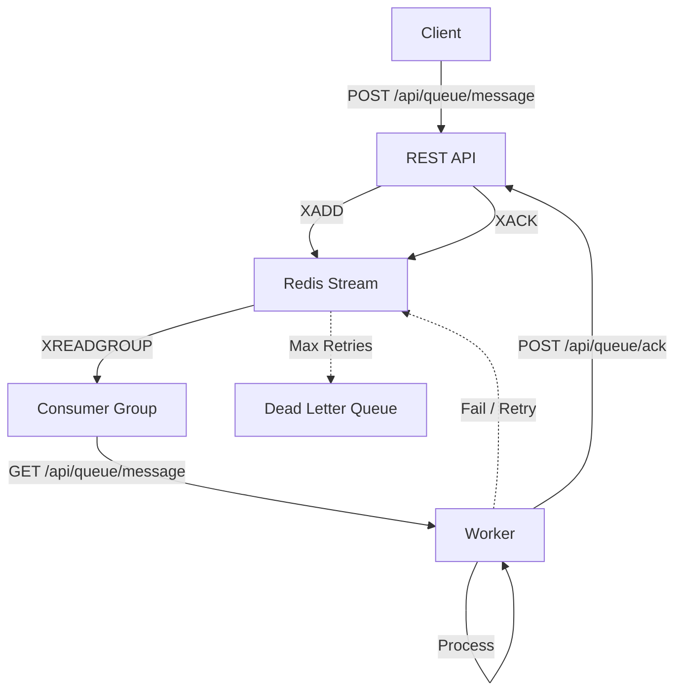

# Redis Queue API

> **A lightweight, language-agnostic message broker built on native Redis Streams.**

Most queue libraries lock you into a specific language ecosystem. This library provides a standard protocol over Redis Streams, allowing you to produce messages in one language (e.g., Node.js API) and consume them in another (e.g., Python/Go Worker) with zero friction. It handles the heavy lifting of Consumer Groups, Acknowledgments, and Dead Letter Queues (DLQ) without the bloat.

---

## 🎯 The "Polyglot" Problem

**The Problem:** Existing queue libraries are excellent within their own language (BullMQ for Node, Celery for Python, Sidekiq for Ruby), but they make it very hard to mix languages. If you want a Node.js API to send jobs to a Python AI worker, those libraries are painful.

**This Solution:** This library provides a **REST API** built on Native Redis Streams. Any language that can make HTTP requests can produce or consume messages—no language-specific SDKs required. Your Node.js API sends messages via HTTP, your Python worker consumes via HTTP, your Go service monitors via HTTP. Simple, standard, and truly polyglot.

---

## 📊 How It Compares

| Feature | This Library | BullMQ / Sidekiq / Celery | Raw Redis Lists (RPOP) |
|---------|-------------|---------------------------|------------------------|
| **Primary Goal** | Polyglot Compatibility | Language-Specific Features | Basic FIFO Queue |
| **Architecture** | Redis Streams (Consumer Groups) | Proprietary Lua Scripts / Lists | Simple Lists |
| **Worker Language** | **Any** (Python, Go, Node, etc.) | Locked (Node only, or Ruby only) | Any |
| **Reliability** | High (Atomic "Pending" state) | High | Low (Lost if worker crashes) |
| **Complexity** | Low (Thin Wrapper) | High (Heavy dependencies) | High (Manual safety logic) |
| **DLQ Logic** | Built-in | Built-in | Manual Implementation |
| **Infrastructure** | Redis (you probably have it) | Redis + Framework | Redis only |

---

## 🔍 Detailed Comparisons

### vs. BullMQ / Celery / Sidekiq

**The Problem with them:** These are "heavy" frameworks. If you use BullMQ, your workers must be Node.js. If you want a Python worker, you have to find a Python port of BullMQ (which might be outdated) or rewrite your worker.

**This Solution:** This library uses Native Redis Streams under the hood. It doesn't use custom Lua scripts that hide logic. This means a producer in Go and a worker in Python see the exact same standard Redis data, accessed through a simple REST API.

### vs. RabbitMQ / Kafka

**The Problem with them:** They require setting up entirely new infrastructure. They are complex to maintain and often overkill for simple use cases.

**This Solution:** You probably already have Redis. This library gives you Kafka-like reliability (Consumer Groups, Replay, Acknowledgements) using your existing Redis instance.

### vs. Raw Redis (LPUSH/RPOP)

**The Problem with them:** The naive approach (RPOPLPUSH) is dangerous. If a worker takes a job and crashes before finishing, that message is gone forever.

**This Solution:** We use Consumer Groups. When a worker takes a job, it enters a "Pending" state in Redis. If the worker crashes, the job is not lost—it sits there waiting to be reclaimed by another worker.

---

## ✨ Key Features

✅ **Atomic Locking**: Uses `XREADGROUP` to ensure a message is processed by only one worker at a time.

✅ **Crash Proof**: Messages are not removed until explicitly Acknowledged (`XACK`). If a worker crashes, messages automatically return to the queue.

✅ **Dead Letter Queue (DLQ)**: Automatically moves "poison pill" messages to a separate stream after N failures.

✅ **Zero-Config Persistence**: Leverages Redis AOF/RDB for data safety.

✅ **Priority Queues**: Support for 10 priority levels (0-9). Higher priority messages are processed first.

✅ **Built-in Retry Logic**: Failed messages are automatically retried with configurable attempts.

✅ **Web Dashboard**: Beautiful real-time monitoring dashboard included.

✅ **Standard Protocol**: Any Redis GUI (like RedisInsight) can visualize your queues instantly because they are just standard Streams.

---

## 🚀 The "Polyglot" Power

### Produce in Node.js:

```javascript
// Node.js API Server
const response = await fetch('http://localhost:3000/api/queue/message', {
  method: 'POST',
  headers: { 'Content-Type': 'application/json' },
  body: JSON.stringify({
    type: 'video_transcode',
    payload: { file: 'movie.mp4', quality: '1080p' },
    priority: 1
  })
});
```

### Consume in Python:

```python
# Python Worker
import requests
import json

API_URL = 'http://localhost:3000/api/queue'

while True:
    # Get a message (blocks for up to 30 seconds)
    response = requests.get(f'{API_URL}/message', params={'timeout': 30})
    
    if response.status_code == 200:
        message = response.json()
        print(f"Processing: {message['payload']['file']}")
        
        # Process video...
        process_video(message['payload'])
        
        # Acknowledge
        requests.post(f'{API_URL}/ack', json={
            'id': message['id'],
            '_stream_id': message['_stream_id'],
            '_stream_name': message['_stream_name']
        })
    elif response.status_code == 404:
        # No messages available
        continue
```

### Consume in Go:

```go
// Go Worker
package main

import (
    "bytes"
    "encoding/json"
    "io"
    "net/http"
    "time"
)

func main() {
    apiURL := "http://localhost:3000/api/queue"
    
    for {
        // Get a message
        resp, _ := http.Get(apiURL + "/message?timeout=30")
        
        if resp.StatusCode == 200 {
            body, _ := io.ReadAll(resp.Body)
            var message map[string]interface{}
            json.Unmarshal(body, &message)
            
            // Process...
            processVideo(message["payload"])
            
            // Acknowledge
            ackData, _ := json.Marshal(map[string]interface{}{
                "id":          message["id"],
                "_stream_id":   message["_stream_id"],
                "_stream_name": message["_stream_name"],
            })
            http.Post(apiURL+"/ack", "application/json", bytes.NewBuffer(ackData))
        }
        
        time.Sleep(1 * time.Second)
    }
}
```

**The Magic:** All three languages use the same REST API. No language-specific SDKs, no direct Redis connections—just standard HTTP requests that any language can make.

---

## 📦 Installation

1. Clone the repository:

```bash
git clone https://github.com/mood-agency/redis-queue-api.git
cd redis-queue-api
```

2. Install dependencies:

```bash
pnpm install
```

3. Start a Redis instance (Docker recommended):

```bash
docker run -d --name redis-stack -p 6379:6379 -p 8001:8001 redis/redis-stack:latest
```

This starts Redis on port 6379 and RedisInsight on port 8001 (optional, for viewing data).

4. Configure environment variables:

Create a `.env` file:

```ini
REDIS_HOST=localhost
REDIS_PORT=6379
REDIS_PASSWORD=
QUEUE_NAME=queue
ACK_TIMEOUT_SECONDS=30
MAX_ATTEMPTS=3
```

5. Run the API server:

```bash
# Development mode (with hot-reloading)
pnpm run dev

# Production mode
pnpm start
```

The API will be available at `http://localhost:3000`

---

## 🎮 Quick Start

### Using the REST API

**Add a message:**

```bash
curl -X POST http://localhost:3000/api/queue/message \
  -H "Content-Type: application/json" \
  -d '{
    "type": "email_send",
    "payload": {
      "to": "user@example.com",
      "subject": "Welcome!"
    },
    "priority": 0
  }'
```

**Get a message:**

```bash
curl "http://localhost:3000/api/queue/message?timeout=30"
```

**Acknowledge a message:**

```bash
curl -X POST http://localhost:3000/api/queue/ack \
  -H "Content-Type: application/json" \
  -d '{
    "id": "message-id-here",
    "_stream_id": "stream-id-here",
    "_stream_name": "queue"
  }'
```

---

## 🏗️ Architecture Overview

This Redis Queue API implements a **reliable message queue system** using **Redis Streams** to ensure message durability, at-least-once delivery, and consumer groups for scaling.

### Redis Data Structures

The queue uses Redis Streams and Hash structures consistently across all queues:

1. **`queue`**, **`queue_p1`** ... **`queue_p9`** - **Priority Streams (10 levels)**
   - Stores messages with unique IDs generated by Redis
   - Supports Consumer Groups for parallel processing
   - Messages are added via `XADD` to the appropriate priority stream
   - Messages are read via `XREADGROUP` (highest priority streams checked first)
   - Priority 0 = `queue` (lowest), Priority 9 = `queue_p9` (highest)
   - Processing messages are tracked in the Pending Entries List (PEL) of these streams

2. **`queue_dlq`** - **Dead Letter Queue (Stream)**
   - Stores messages that failed after maximum retry attempts
   - Useful for debugging and manual intervention

3. **`queue_acknowledged`** - **Acknowledged Queue (Stream)**
   - Stores successfully processed messages for history/audit
   - Uses `XTRIM` with `MAXLEN` for automatic size limiting
   - Consistent with other queues for easier querying and management

4. **`queue_metadata`** - **Metadata Hash**
   - Stores additional message metadata (attempt counts, errors) not directly stored in the stream message body
   - Key-value pairs with message ID as key

### Message Lifecycle



### Message Format

```json
{
  "id": "uuid-here",           // Auto-generated if not provided
  "type": "string",            // Required: Message type identifier
  "payload": {},               // Optional: Message data (any JSON)
  "priority": 0,              // Optional: Priority level 0-9 (higher = processed first)
  "created_at": 1234567890    // Auto-generated timestamp
}
```

**Priority Levels:**
- `0` = Lowest priority (default)
- `1-8` = Intermediate priorities
- `9` = Highest priority (processed first)

### Configuration

- **ACK_TIMEOUT_SECONDS**: `30` - Time before a message in the Pending Entries List (PEL) is considered stalled
- **MAX_ATTEMPTS**: `3` - Maximum retry attempts before moving to dead letter queue
- **BATCH_SIZE**: `100` - Maximum messages processed in batch operations
- **MAX_PRIORITY_LEVELS**: `10` - Number of priority levels (0 to N-1, default 10 = priorities 0-9)

---

## 📡 API Endpoints

### Queue Operations

- `POST /api/queue/message` - Add a message to the queue
- `GET /api/queue/message?timeout=30` - Get a message from the queue
- `POST /api/queue/ack` - Acknowledge message processing
- `POST /api/queue/batch` - Add multiple messages at once

### Monitoring

- `GET /api/health` - Health check endpoint
- `GET /api/queue/metrics` - Queue statistics and metrics
- `GET /api/queue/status` - Get detailed status of all queues with messages
- `GET /api/queue/messages?startTimestamp&endTimestamp` - Get messages by date range
- `DELETE /api/queue/messages?startTimestamp&endTimestamp` - Remove messages by date range

---

## 🎯 Web Dashboard

The API includes a beautiful web dashboard for real-time queue monitoring:

### Accessing the Dashboard

- **URL**: `http://localhost:3000/dashboard`
- **Root redirect**: `http://localhost:3000/` automatically redirects to dashboard

### Dashboard Features

- **📊 Real-time Statistics**: View total processed, failed, queued, and processing messages
- **📥 Main Queue**: See all messages waiting to be processed
- **⚡ Processing Queue**: Monitor messages currently being processed
- **💀 Dead Letter Queue**: View failed messages that exceeded retry limits
- **🔄 Auto-refresh**: Automatically updates every 5 seconds
- **📱 Responsive Design**: Works on desktop and mobile devices
- **🎨 Modern UI**: Beautiful gradient design with smooth animations

### Testing the Dashboard

Use the included TypeScript script to populate the dashboard with sample data:

```bash
# Run the dashboard demo
npx tsx test_dashboard.ts

# Add custom number of messages
npx tsx test_dashboard.ts --messages 25

# Use different server URL
npx tsx test_dashboard.ts --url http://localhost:8080
```

---

## 🧪 Running Tests

To run the integration tests for the queue API:

```bash
npm test src/routes/queue/queue.test.ts
```

This runs the Vitest suite covering:
- Health checks
- Enqueuing and dequeuing messages
- Message acknowledgment (with Redis Streams support)
- Error handling and invalid requests

---

## ⚙️ Environment Variables

You can customize queue behavior via environment variables:

```bash
# Redis Connection
REDIS_HOST=localhost
REDIS_PORT=6379
REDIS_PASSWORD=
REDIS_DB=0

# Queue Names (optional - defaults provided)
QUEUE_NAME=queue
PROCESSING_QUEUE_NAME=queue_processing
DEAD_LETTER_QUEUE_NAME=queue_dlq
METADATA_HASH_NAME=queue_metadata

# Queue Configuration
ACK_TIMEOUT_SECONDS=30
MAX_ATTEMPTS=3
BATCH_SIZE=100
MAX_PRIORITY_LEVELS=10  # Number of priority levels (0 to N-1)
```

---

## 📝 Available Scripts

- `pnpm run dev` - Starts the application in development mode with hot-reloading
- `pnpm run build` - Compiles the TypeScript code
- `pnpm start` - Builds and starts the application in production mode
- `pnpm test` - Runs the test suite
- `pnpm dashboard:dev` - Starts the dashboard UI in development mode
- `pnpm dashboard:build` - Builds the dashboard UI for production

---

## 🎓 Why This Approach?

### Don't Compete on Features

We won't beat BullMQ on plugins/UI. We won't beat Kafka on throughput. We won't beat RabbitMQ on routing complexity.

### Compete on Flexibility

We are the **bridge between languages**. Your Node.js API can send messages to Python AI workers, Go image processors, or Ruby email senders—all using the same REST API.

### Compete on Simplicity

We are **closer to the metal** (Redis Streams) than the heavy frameworks. No hidden Lua scripts, no magic—just standard Redis Streams accessed through a simple REST API that any developer can understand and debug.

---

## 🤝 Contributing

Contributions are welcome! Please feel free to submit a Pull Request.

---

## 📄 License

ISC

---

## 🙏 Acknowledgments

Built with:
- [Hono](https://hono.dev/) - Fast web framework
- [ioredis](https://github.com/redis/ioredis) - Redis client
- [Redis Streams](https://redis.io/docs/data-types/streams/) - Native Redis data structure

---

**Ready to break free from language-specific queue libraries?** 🚀
