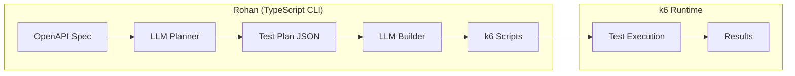

# Rohan

**OpenAPI Test Generator for k6**

Rohan is a CLI tool that automatically generates [k6](https://k6.io) test scripts from your OpenAPI specification using LLMs. It analyzes your API spec and produces production-ready JavaScript tests that you can run with k6.

## Features

- **Automatic Test Generation** - LLM analyzes your OpenAPI spec and generates intelligent test scenarios
- **k6 Compatible** - Outputs standard k6 JavaScript tests that work with k6's battle-tested runtime
- **Multiple LLM Providers** - Works with Groq, OpenAI, Anthropic, Together, Fireworks, and Ollama
- **Batching** - Efficient batch processing to reduce API calls and costs
- **E2E Workflows** - Generate multi-step end-to-end test scenarios

## Test Scenario Coverage

Rohan generates comprehensive test cases covering multiple scenario categories:

### Simple/Unit Test Scenarios

| Category | Description | Example Tests |
|----------|-------------|---------------|
| **Happy Path** | Valid requests with expected inputs | `Get_Users_Basic`, `Create_User_With_All_Fields` |
| **Boundary** | Edge values (min, max, zero, negative) | `Create_Message_Zero_Priority`, `Get_Message_Max_Timeout` |
| **Negative/Validation** | Invalid inputs that should fail | `Fail_Create_User_Missing_Email`, `Fail_Update_Invalid_JSON` |
| **Data Type Variations** | Different types for flexible fields | `Create_Message_String_Payload`, `Create_Message_Array_Payload` |
| **Edge Cases** | Unusual but valid inputs | `Create_User_Unicode_Name`, `Update_Message_Empty_String` |
| **Batch Operations** | Collection/array operations | `Create_Batch_Five_Messages`, `Fail_Batch_Not_An_Array` |
| **Security** | Injection and attack vectors | `Security_Create_SQL_Injection_Name`, `Security_Update_XSS_Field` |

### Integration/E2E Test Scenarios

| Category | Description | Example Tests |
|----------|-------------|---------------|
| **CRUD Lifecycle** | Full create → read → update → delete | `CRUD_User_Full_Lifecycle` |
| **State Verification** | Verify changes persist correctly | `Update_And_Verify_Persistence` |
| **Deletion Verification** | Verify 404 after delete | `Delete_Then_Verify_Not_Found` |
| **List Consistency** | Verify list reflects mutations | `Batch_Create_Then_List_Verify` |
| **Concurrent Access** | Race conditions and parallel access | `Concurrent_Update_Same_Resource` |
| **Idempotency** | Duplicate request handling | `Idempotency_Duplicate_POST_No_Duplicate` |

### Scenario Details

<details>
<summary><strong>Boundary & Edge Cases</strong></summary>

- Zero values (`priority: 0`, `timeout: 0`)
- Negative numbers (`maxAttempts: -1`)
- Maximum values (`timeout: 2147483647`)
- Minimum values (`retries: 1`)
- Decimal values for integer fields (`count: 1.5`)
- Empty strings, arrays, objects
- Very long strings (1000+ chars)
- Special characters and Unicode/Emoji

</details>

<details>
<summary><strong>Negative/Validation Tests</strong></summary>

- Missing required fields
- Wrong data types (`"priority": "high"` instead of number)
- Malformed JSON body
- Empty request body
- Out of range values
- Invalid enum values

</details>

<details>
<summary><strong>Security Tests</strong></summary>

- **SQL Injection**: `'; DROP TABLE users; --`
- **XSS**: `<script>alert('xss')</script>`
- **Path Traversal**: `../../etc/passwd`
- **Command Injection**: `; rm -rf /`
- **Integer Overflow**: Values exceeding max int

</details>

<details>
<summary><strong>E2E Workflow Tests</strong></summary>

- Create resource → Read → Verify data matches
- Update resource → Read → Verify changes saved
- Delete resource → Read → Verify 404 returned
- Batch create → List → Verify count matches
- Concurrent modifications → Verify consistency

</details>

## Quick Start

### Prerequisites

- **Node.js 20+** (for running Rohan)
- **k6** (for running generated tests)
- **An LLM API key** (Groq, OpenAI, Anthropic, etc.)

### Install k6

```bash
# Windows
choco install k6
# or
winget install k6

# macOS
brew install k6

# Linux (Debian/Ubuntu)
sudo gpg -k
sudo gpg --no-default-keyring --keyring /usr/share/keyrings/k6-archive-keyring.gpg --keyserver hkp://keyserver.ubuntu.com:80 --recv-keys C5AD17C747E3415A3642D57D77C6C491D6AC1D69
echo "deb [signed-by=/usr/share/keyrings/k6-archive-keyring.gpg] https://dl.k6.io/deb stable main" | sudo tee /etc/apt/sources.list.d/k6.list
sudo apt-get update
sudo apt-get install k6
```

See [k6 installation docs](https://k6.io/docs/get-started/installation/) for more options.

### Install Rohan

```bash
# Clone the repository
git clone https://github.com/yourusername/rohan.git
cd rohan

# Install dependencies
npm install

# Build
npm run build

# Run (from project directory)
npm run rohan -- --help
```

### Usage

Set your LLM provider's API key:

```bash
# For Groq (default)
export GROQ_API_KEY="your-groq-api-key"

# For OpenAI
export OPENAI_API_KEY="your-openai-api-key"

# For Anthropic
export ANTHROPIC_API_KEY="your-anthropic-api-key"
```

Generate tests and run them:

```bash
# Step 1: Generate test plan from OpenAPI spec
npm run rohan -- plan api-spec.json -o test-plan.json -w 5 --batch-size 5

# Step 2: Build k6 scripts from the plan
npm run rohan -- build test-plan.json -o tests/ -w 5 --batch-size 5

# Step 3: Run tests with k6
k6 run --env BASE_URL=http://localhost:8080 tests/test_get_users_basic.js

# Or run all tests
for f in tests/*.js; do k6 run --env BASE_URL=http://localhost:8080 "$f"; done
```

## Workflow

### Step 1: Generate Test Plan

```bash
npm run rohan -- plan api-spec.json -o test-plan.json -w 5
```

Creates a `test-plan.json` file containing test entries:

```json
{
  "version": "1.0",
  "api_title": "My API",
  "api_version": "1.0.0",
  "tests": [
    {
      "name": "Get_Users_Basic",
      "method": "GET",
      "path": "/users",
      "endpoint_spec": { ... }
    },
    {
      "name": "Create_User_Basic",
      "method": "POST",
      "path": "/users",
      "endpoint_spec": { ... }
    }
  ]
}
```

### Step 2: Build k6 Scripts

```bash
npm run rohan -- build test-plan.json -o tests/ -w 5
```

Generates k6-compatible JavaScript tests with descriptive filenames:

```
tests/
├── manifest.json
├── test_get_users_basic.js
├── test_create_user_basic.js
└── ...
```

By default, existing test files are **not overwritten**. Use `--overwrite` to replace them:

```bash
npm run rohan -- build test-plan.json -o tests/ --overwrite
```

Each test file is a complete k6 script:

```javascript
// Test: Get_Users_Basic
// Generated by Rohan

import http from 'k6/http';
import { check } from 'k6';

const BASE_URL = __ENV.BASE_URL || 'http://localhost:8080';

export default function() {
    const res = http.get(`${BASE_URL}/users`);
    check(res, {
        'status is 200': (r) => r.status === 200,
    });
}
```

### Step 3: Run with k6

```bash
# Run a single test
k6 run --env BASE_URL=http://localhost:8080 tests/test_get_users_basic.js

# Run all tests (bash/zsh)
for f in tests/*.js; do k6 run --env BASE_URL=http://localhost:8080 "$f"; done

# Run all tests (PowerShell)
Get-ChildItem tests\*.js | ForEach-Object { k6 run --env BASE_URL=http://localhost:8080 $_.FullName }

# Load test with 10 virtual users for 30 seconds
k6 run --env BASE_URL=http://localhost:8080 --vus 10 --duration 30s tests/test_get_users_basic.js
```

## CLI Reference

### Commands

| Command | Description |
|---------|-------------|
| `plan` | Generate test plan JSON from an OpenAPI spec |
| `build` | Build k6 test scripts from a test plan JSON file |
| `exec` | Show instructions for running tests with k6 |
| `validate` | Validate an OpenAPI specification |

### `plan` Command

```bash
npm run rohan -- plan <spec-path> [options]
```

| Flag | Type | Default | Description |
|------|------|---------|-------------|
| `-o`, `--output` | path | `test-plan.json` | Output file for the test plan |
| `-w`, `--workers` | int | 5 | Number of parallel LLM workers |
| `--model` | string | `llama-3.3-70b-versatile` | LLM model identifier |
| `--provider` | string | auto-detect | LLM provider (groq, openai, anthropic, together, fireworks, ollama) |
| `--api-base` | URL | auto-detected | Custom LLM API endpoint |
| `--batch-size` | int | 5 | Number of endpoints to batch per LLM request |
| `--rpm` | int | 0 | Max requests per minute (0 = unlimited) |
| `--e2e` | bool | false | Generate E2E workflow tests |
| `--verbose` | bool | false | Enable detailed logging |
| `--prompt-dir` | path | - | Custom prompt directory |

### `build` Command

```bash
npm run rohan -- build <plan-path> [options]
```

| Flag | Type | Default | Description |
|------|------|---------|-------------|
| `-o`, `--output` | path | `tests/` | Output directory for test scripts |
| `--overwrite` | bool | `false` | Overwrite existing test files |
| `-w`, `--workers` | int | 5 | Number of parallel LLM workers |
| `--model` | string | `llama-3.3-70b-versatile` | LLM model identifier |
| `--provider` | string | auto-detect | LLM provider |
| `--api-base` | URL | auto-detected | Custom LLM API endpoint |
| `--batch-size` | int | 5 | Number of tests to batch per LLM request |
| `--rpm` | int | 0 | Max requests per minute (0 = unlimited) |
| `--e2e` | bool | false | Build E2E workflow tests |
| `--verbose` | bool | false | Enable detailed logging |
| `--prompt-dir` | path | - | Custom prompt directory |

### `exec` Command

```bash
npm run rohan -- exec <tests-dir> [--target URL]
```

Shows instructions for running the generated tests with k6.

| Flag | Type | Default | Description |
|------|------|---------|-------------|
| `--target` | URL | `http://localhost:8080` | Base URL for example commands |

### `validate` Command

```bash
npm run rohan -- validate <spec-path>
```

Validates an OpenAPI specification file and shows basic info.

## LLM Providers

Rohan supports multiple LLM providers:

| Provider | Package | Env Variable | Example Models |
|----------|---------|--------------|----------------|
| Groq | `@ai-sdk/groq` | `GROQ_API_KEY` | `llama-3.3-70b-versatile` |
| OpenAI | `@ai-sdk/openai` | `OPENAI_API_KEY` | `gpt-4o`, `gpt-4o-mini` |
| Anthropic | `@ai-sdk/anthropic` | `ANTHROPIC_API_KEY` | `claude-sonnet-4-20250514` |
| Together | via OpenAI compat | `TOGETHER_API_KEY` | `meta-llama/Llama-3-70b-chat-hf` |
| Fireworks | via OpenAI compat | `FIREWORKS_API_KEY` | `llama-v3-70b-instruct` |
| Ollama | via OpenAI compat | - | `llama3`, `mistral` |

### Provider Examples

```bash
# Groq (default)
export GROQ_API_KEY="gsk_..."
npm run rohan -- plan api-spec.json --model llama-3.3-70b-versatile

# OpenAI
export OPENAI_API_KEY="sk-..."
npm run rohan -- plan api-spec.json --provider openai --model gpt-4o

# Anthropic
export ANTHROPIC_API_KEY="sk-ant-..."
npm run rohan -- plan api-spec.json --provider anthropic --model claude-sonnet-4-20250514

# Local Ollama
npm run rohan -- plan api-spec.json --provider ollama --model llama3
```

## Batching for Efficiency

Rohan supports batching multiple endpoints/tests per LLM request, which significantly reduces:

- **API calls**: 50 endpoints with batch size 5 = 10 requests instead of 50
- **Token consumption**: System prompts sent once per batch instead of once per item
- **Rate limit pressure**: Fewer requests means less chance of hitting rate limits

```bash
# Batch 10 endpoints per request during planning
npm run rohan -- plan api-spec.json --batch-size 10

# Batch 5 tests per request during building (default)
npm run rohan -- build test-plan.json --batch-size 5

# Disable batching (one item per request)
npm run rohan -- plan api-spec.json --batch-size 1
```

## Prompt Customization

Prompts are stored in the `prompts/` directory. Override them with `--prompt-dir`:

```bash
npm run rohan -- plan api-spec.json --prompt-dir ./my-prompts/
```

| File | Purpose |
|------|---------|
| `planner_system.md` | System prompt for test scenario planning |
| `planner_user.md` | User prompt template for planning |
| `builder_system.md` | System prompt for JavaScript code generation |
| `builder_user.md` | User prompt template for code gen |
| `planner_batch_system.md` | System prompt for batched planning |
| `planner_batch_user.md` | User prompt for batched planning |
| `builder_batch_system.md` | System prompt for batched building |
| `builder_batch_user.md` | User prompt for batched building |
| `e2e_planner_system.md` | System prompt for E2E workflow planning |
| `e2e_planner_user.md` | User prompt for E2E planning |
| `e2e_builder_system.md` | System prompt for E2E script generation |
| `e2e_builder_user.md` | User prompt for E2E building |

## Development

```bash
# Install dependencies
npm install

# Build TypeScript
npm run build

# Watch mode (rebuild on changes)
npm run dev

# Run tests
npm test

# Clean build artifacts
npm run clean
```

## Architecture



Rohan handles **test generation**, k6 handles **test execution**.

## Why k6?

k6 is the industry standard for API and load testing:

- **Performance** - Written in Go, handles thousands of virtual users
- **Scripting** - JavaScript/ES6 syntax that's easy to read and modify
- **Metrics** - Built-in latency percentiles, throughput, error rates
- **Integrations** - Grafana, InfluxDB, Prometheus, CI/CD systems
- **Extensions** - Browser testing, Kafka, Redis, SQL, and more

## License

MIT

---

**Rohan** - *LLM-powered test generation for k6*
