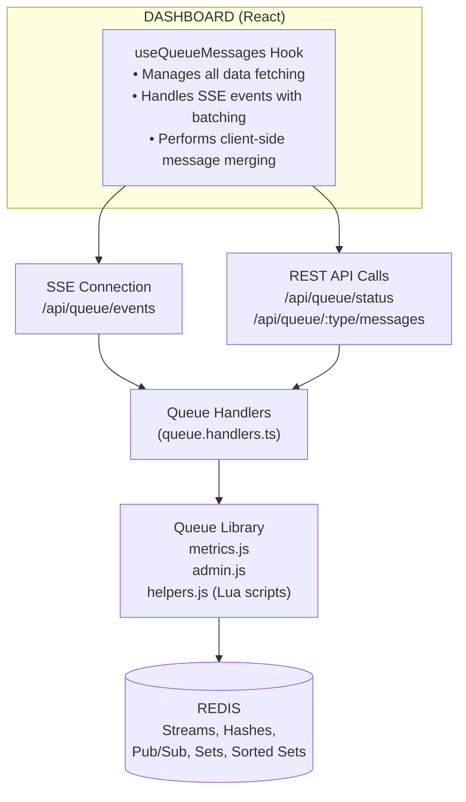
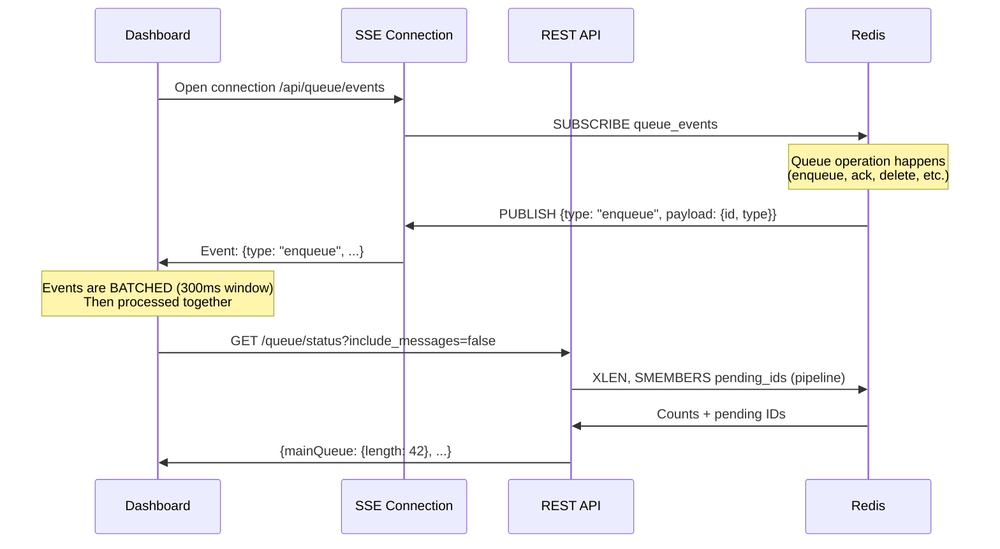
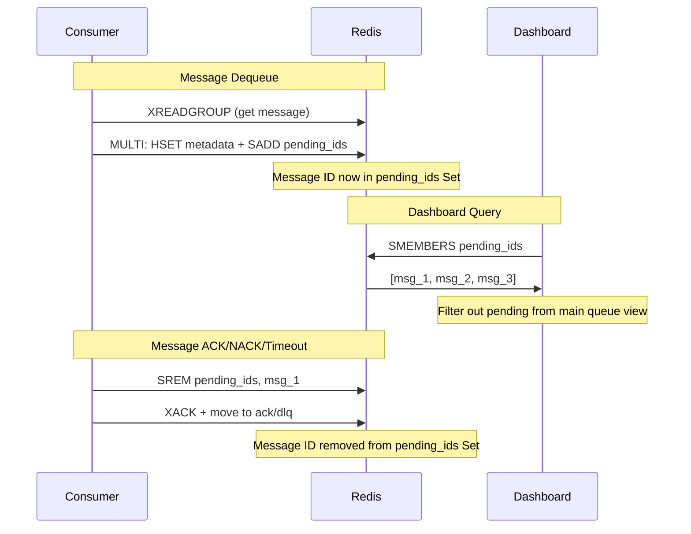

# Dashboard Data Flow & Redis Read Patterns

This document explains how the Relay dashboard retrieves and displays queue data, detailing the Redis operations involved and their performance characteristics.

## Overview

The dashboard uses a hybrid approach for data fetching:
1. **Server-Sent Events (SSE)** for real-time updates
2. **REST API polling** for status counts and paginated message data
3. **Smart client-side merging** to reduce unnecessary full fetches
4. **Event batching** to handle high-throughput scenarios efficiently

## Data Flow Architecture



## How SSE Works (Important)

The SSE connection does **not** push full data from the server. Instead:



**Key points:**
1. SSE events are **notifications only** - they contain event type and minimal metadata (IDs)
2. The dashboard must **call the REST API** to get actual counts/data
3. `publishEvent()` is called by queue operations (enqueue, ack, delete, move)
4. The dashboard throttles status fetches to **max 1 per 2 seconds** on SSE events
5. **NEW:** Events are batched in 300ms windows before processing (reduces re-renders)
6. **NEW:** Unauthenticated clients receive lightweight events (reduced bandwidth)

**SSE Event Payload Example (Authenticated):**
```json
{
  "type": "enqueue",
  "timestamp": 1704067200000,
  "payload": {
    "count": 1,
    "message": { "id": "msg_123", "type": "order", "payload": {...} }
  }
}
```

**SSE Event Payload Example (Unauthenticated - Lightweight):**
```json
{
  "type": "enqueue",
  "timestamp": 1704067200000,
  "payload": {
    "count": 1,
    "force_refresh": false,
    "messages": [{ "id": "msg_123", "type": "order", "priority": 0, "payload": "[REDACTED]" }]
  }
}
```

For `enqueue` events, the dashboard attempts **client-side merging** if the full message data is included. Otherwise, it falls back to fetching via REST API.

## API Endpoints Used by Dashboard

| Endpoint | Purpose | When Called | Redis Cost |
|----------|---------|-------------|------------|
| `GET /queue/config` | Fetch timeout/retry settings | Once on load | None |
| `GET /queue/status` | Queue counts + optional messages | On load, SSE events | Medium-High |
| `GET /queue/:type/messages` | Paginated messages with filters | Tab change, pagination | Low-Medium |
| `GET /queue/events` (SSE) | Real-time updates stream | Persistent connection | Low (Pub/Sub) |

## Redis Data Structures

The dashboard reads from these Redis structures:

### Streams (Message Storage)
- `queue` - Priority 0 (default) messages
- `queue_p1` to `queue_p9` - Priority 1-9 messages
- `queue_manual` - Messages moved to processing via UI
- `queue_dlq` - Dead Letter Queue (failed messages)
- `queue_acknowledged` - Successfully processed messages
- `queue_archived` - Archived messages

### Hashes (Metadata)
- `queue:metadata` - Message metadata (attempt count, errors, timeouts)
- `queue:consumer_stats` - Consumer statistics
- `queue:type_index:loc` - Message ID to stream location mapping

### Sets (Caching)
- `queue:pending_ids` - Fast cache of message IDs currently in processing state
- `queue:type_index:types` - Set of all known message types

### Sorted Sets (Type Index)
- `queue:type_index:zset:{type}` - Message IDs indexed by type, sorted by priority + timestamp

### Pub/Sub
- `queue_events` - Real-time event channel

---

## Detailed Redis Read Patterns

### 1. Status Fetch (Lightweight Mode)

**Triggered by:** SSE events (throttled to max 1 per 2 seconds)

**API:** `GET /queue/status?include_messages=false`

**Function:** `getQueueStatus(typeFilter, includeMessages=false)` in [metrics.js](../src/lib/queue/metrics.js)

```
Redis Pipeline:
├── XLEN queue_manual
├── XLEN queue_p9, queue_p8, ... queue_p1, queue  (10 streams)
├── XLEN queue_dlq
├── XLEN queue_acknowledged
├── XLEN queue_archived
├── GET queue:total_acknowledged
└── XPENDING queue_manual, queue_p9..queue GROUP queue-consumers  (11 streams)
```

**Total Redis Commands:** ~24 in a single pipeline

**Cost:** Low - Only counts, no message content

**Purpose:** Update the queue count badges in the dashboard sidebar without fetching full message data.

---

### 2. Status Fetch (Full Mode)

**Triggered by:** Initial page load

**API:** `GET /queue/status` (or `include_messages=true`)

**Function:** `getQueueStatus(typeFilter, includeMessages=true)` in [metrics.js](../src/lib/queue/metrics.js)

```
Pipeline 1 (Main fetch):
├── XLEN for all 11 priority streams
├── XLEN queue_dlq, queue_acknowledged, queue_archived
├── GET queue:total_acknowledged
├── XPENDING summary for all 11 streams
├── XREVRANGE for all 11 priority streams (COUNT 1000 each)
├── XREVRANGE queue_dlq (COUNT 1000)
├── XREVRANGE queue_acknowledged (COUNT 1000)
├── XREVRANGE queue_archived (COUNT 1000)
└── HGETALL queue:metadata

Pipeline 2 (Verify pending messages exist):
└── XRANGE streamName streamId streamId  (per pending message)

Pipeline 3 (Fetch metadata for pending):
└── HGET queue:metadata messageId  (per pending message)

Filter out pending from main (OPTIMIZED):
└── SMEMBERS queue:pending_ids  (single call, replaces N XPENDING calls)
```

**Total Redis Commands:** ~30-50 (optimized from 50-200+)

**Cost:** Medium - Fetches up to 1000 messages per queue type

**Why the optimization matters:**
Previously, filtering required N XPENDING calls (one per displayed message) to check if each message was in processing state. Now, a single `SMEMBERS` call retrieves all pending message IDs, reducing 50-200+ commands to ~30-50.

---

### 3. Paginated Messages Fetch

**Triggered by:** Tab navigation, pagination, filter changes

**API:** `GET /queue/:queueType/messages?page=1&limit=100&...`

**Function:** `getQueueMessages(queueType, params)` in [admin.js](../src/lib/queue/admin.js)

#### For Main Queue (Standard):

```
Step 1 - Get pending IDs (OPTIMIZED):
└── SMEMBERS queue:pending_ids  (single call, replaces 11 XPENDING calls)

Step 2 - Fetch messages:
├── XREVRANGE queue "+" "-" COUNT fetchCount
├── XREVRANGE queue_p1 "+" "-" COUNT fetchCount
└── ... (all priority streams)

Step 3 - Filter out pending messages (in-memory):
└── Filter using Set lookup from Step 1

Step 4 - Load metadata:
└── HMGET queue:metadata id1 id2 id3...
```

#### For Main Queue (Type-Filtered - NEW OPTIMIZATION):

When filtering by a single message type, the type index is used for O(1) lookups:

```
Step 1 - Get pending IDs:
└── SMEMBERS queue:pending_ids

Step 2 - Query type index:
└── ZREVRANGE queue:type_index:zset:{type} 0 {fetchCount-1}

Step 3 - Get message locations:
└── HMGET queue:type_index:loc id1 id2 id3...

Step 4 - Fetch messages (pipeline):
└── XRANGE stream1 msgId1 msgId1
└── XRANGE stream2 msgId2 msgId2
└── ... (one per message, pipelined)

Step 5 - Load metadata:
└── HMGET queue:metadata id1 id2 id3...
```

**Impact:** For rare message types, reduces 5000-message scan to exact match count.

**fetchCount calculation:**
- Without filters: `(page * limit) + 100` (e.g., page 1 with 100 limit = 200)
- With filters (search, date, type): `5000` (needs larger pool to filter)
- With single type filter: Uses type index directly (no scan needed)

#### For Processing Queue (NEW: Lua Script Optimization):

The processing queue now uses a Lua script for single round-trip fetch:

```lua
-- Lua script fetches all in one call:
-- XPENDING + XRANGE + HGET for each pending message
-- Returns: [streamName, msgId, consumer, idle, deliveryCount, msgData, metadata]
```

**Fallback (if Lua fails):**
```
Step 1 - Get all pending entries:
├── XPENDING queue GROUP "-" "+" 5000
└── ... (all priority streams)

Step 2 - Fetch each pending message:
└── XRANGE streamName msgId msgId  (pipeline, per pending message)

Step 3 - Load metadata:
└── HGET queue:metadata messageId  (pipeline, per message)
```

**Impact:** Reduces 10 + 2*N Redis round-trips to 1 (Lua) or 3 (fallback).

#### For Dead/Acknowledged/Archived Queues:

```
Step 1 - Fetch messages:
└── XREVRANGE queue_dlq "+" "-" COUNT fetchCount

Step 2 - Load metadata:
└── HMGET queue:metadata id1 id2 id3...
```

**Cost:** Medium - Simpler as these are just streams without PEL complexity

---

### 4. Real-Time Updates (SSE)

**Function:** `publishEvent(type, payload)` in [helpers.js](../src/lib/queue/helpers.js)

**Redis Operation:** `PUBLISH queue_events {event_json}`

**Event Types:**
- `enqueue` - New message added
- `acknowledge` - Message processed successfully
- `delete` - Message deleted
- `move` - Message moved between queues
- `requeue` - Message returned to main queue
- `move_to_dlq` - Message moved to dead letter queue
- `update` - Message metadata updated

**Dashboard Handling ([useQueueMessages.ts](../dashboard-ui/src/components/queue/useQueueMessages.ts)):**

```typescript
// NEW: Events are batched for 300ms before processing
pendingEventsRef.current.push({ type, payload })
if (!batchTimeoutRef.current) {
  batchTimeoutRef.current = setTimeout(processBatchedEvents, 300)
}

// processBatchedEvents groups events by type:
// - All enqueue events merged into one update
// - All delete events merged into one removal
// - Reduces re-renders from N to 1
```

---

## Performance Characteristics

| Operation | Redis Calls | Messages Fetched | Cost Level |
|-----------|-------------|------------------|------------|
| Status (lightweight) | ~24 (pipeline) | 0 | Low |
| Status (full) | ~30-50 (optimized) | Up to 1000/queue | Medium |
| Main queue page | ~15 (optimized) | page*limit + buffer | Low-Medium |
| Main queue (type filter) | ~5 (type index) | exact matches only | **Very Low** |
| Processing queue page | 1 (Lua) or 10+2N | All pending | **Low** (was Medium-High) |
| Dead/Ack/Archive page | 2-5 | page*limit + buffer | Low-Medium |
| SSE event publish | 1 | 0 | Very Low |

---

## Optimizations in Place

### 1. Pending IDs Set Cache (Major Optimization)

A Redis Set (`queue:pending_ids`) maintains a fast cache of all message IDs currently in processing state:



```javascript
// On dequeue: Add to pending set
await redis.multi()
  .hset(metadata_hash, messageId, JSON.stringify(metadata))
  .sadd('queue:pending_ids', messageId)
  .exec();

// On ACK/NACK/timeout: Remove from pending set
pipeline.srem('queue:pending_ids', messageId);

// Dashboard query: Single SMEMBERS replaces N XPENDING calls
const pendingIds = new Set(await redis.smembers('queue:pending_ids'));
mainMessages = mainMessages.filter(m => !pendingIds.has(m.id));
```

**Impact:** Reduces dashboard refresh from 50-200+ Redis operations to ~30-50 operations (40-75% reduction).

### 2. Type Index for Filtered Queries (NEW)

A Redis Sorted Set indexes messages by type for O(1) lookups:

```javascript
// On enqueue: Add to type index
const indexKey = `queue:type_index:zset:${messageType}`;
const score = calculateTypeScore(priority, timestamp);
await redis.zadd(indexKey, score, messageId);
await redis.hset(locationKey, messageId, `${streamName}|${streamId}`);

// Dashboard query: Direct index lookup instead of 5000-message scan
const messageIds = await redis.zrevrange(indexKey, 0, limit);
const locations = await redis.hmget(locationKey, ...messageIds);
```

**Impact:** For type-filtered queries, reduces 5000-message scan to exact match count (90%+ reduction for rare types).

### 3. Lua Script for Processing Queue (NEW)

A Lua script fetches all processing queue data in a single round-trip:

```lua
-- Single script call replaces:
-- - 11 XPENDING calls
-- - N XRANGE calls (one per pending message)
-- - N HGET calls (one per message metadata)

local results = {}
for each stream do
  local pending = redis.call('XPENDING', stream, group, '-', '+', 5000)
  for each entry in pending do
    local msg = redis.call('XRANGE', stream, msgId, msgId)
    local meta = redis.call('HGET', metadata_key, parsedId)
    table.insert(results, {stream, msgId, consumer, idle, count, msg, meta})
  end
end
return results
```

**Impact:** Reduces processing queue fetch from 10 + 2*N round-trips to 1.

### 4. SSE Event Batching (NEW)

Events are accumulated and processed in 300ms batches:

```typescript
// Instead of processing each event immediately:
// Event 1 → re-render → Event 2 → re-render → Event 3 → re-render

// Events are batched:
// [Event 1, Event 2, Event 3] → single merged update → one re-render
```

**Impact:** Reduces re-renders from N to 1 for burst traffic (100 events/sec → 3-4 re-renders/sec).

### 5. Lightweight SSE for Unauthenticated Clients (NEW)

Unauthenticated SSE connections receive minimal event payloads:

```javascript
// Authenticated: Full message data
{ type: "enqueue", payload: { message: { id, type, payload: {...}, ... } } }

// Unauthenticated: Minimal data (bandwidth savings)
{ type: "enqueue", payload: { count: 1, messages: [{ id, type, payload: "[REDACTED]" }] } }
```

**Impact:** 50-90% bandwidth reduction for unauthenticated dashboard viewers.

### 6. Consumer Group Caching
The system tracks which streams have consumer groups to avoid `NOGROUP` errors:
```javascript
// In metrics.js - Only call XPENDING for known consumer groups
if (this.isConsumerGroupKnown(stream)) {
  pipeline.xpending(stream, consumer_group);
}
```

### 7. Pipeline Batching
All Redis operations are batched into pipelines to reduce round-trips:
```javascript
const pipeline = redis.pipeline();
for (const stream of priorityStreams) {
  pipeline.xlen(stream);
}
const results = await pipeline.exec();
```

### 8. COUNT Limits
XREVRANGE uses COUNT to limit data transfer:
```javascript
// Without filters - fetch just enough for current page
const fetchCount = (page * limit) + 100;
// With filters - need larger pool
const fetchCount = hasHeavyFilters ? 5000 : (page * limit) + 100;
```

### 9. Client-Side Event Merging
SSE events for `enqueue` are merged client-side without full refetch:
```javascript
// Instead of fetching, merge new messages into current view
const combined = [...base.messages, ...filteredNew];
combined.sort(compare);
const updatedList = combined.slice(0, pageSize);
```

### 10. Throttled Status Updates
Status fetches from SSE events are throttled:
```javascript
if (now - lastStatusFetchRef.current > 2000) {
  fetchStatus(false);  // Only counts, not full messages
  lastStatusFetchRef.current = now;
}
```

### 11. Cursor-Based Pagination Support (NEW)

API responses now include cursor information for efficient deep pagination:

```json
{
  "messages": [...],
  "pagination": {
    "total": 10000,
    "page": 1,
    "limit": 100,
    "totalPages": 100,
    "nextCursor": "1704067200000-0",
    "hasMore": true
  }
}
```

**Impact:** Enables O(1) seek for deep pages instead of O(n) scan (not yet used by dashboard UI).

---

## When Does the Dashboard Hit Redis Heavily?

1. **Initial Page Load** - Full status fetch (~30-50 commands)
2. **Tab Navigation** - Paginated messages fetch (~15 commands, or ~5 with type index)
3. **Applying Filters** - May need 5000 message scan (unless type filter uses index)
4. **Processing Tab** - Single Lua call (fallback: per-message lookups)

## When is Redis Load Light?

1. **Idle Dashboard** - Only SSE heartbeats (no Redis reads)
2. **SSE Updates** - Single PUBLISH command per event
3. **Status Badge Updates** - Lightweight status fetch (~24 commands)
4. **Client-Side Merging** - New messages merged without fetch
5. **Type-Filtered Views** - Uses type index for O(1) lookups

---

## Summary

The dashboard's Redis read pattern is designed for real-time visibility with acceptable overhead:

- **Light operations** for ongoing updates (SSE + lightweight status)
- **Medium operations** for initial loads and navigation (optimized with pending IDs Set cache)
- **Heavy optimizations** via:
  - Pending IDs Set (40-75% reduction)
  - Type Index for filtered queries (90%+ reduction for rare types)
  - Lua script for processing queue (N round-trips → 1)
  - SSE event batching (N re-renders → 1)
  - Lightweight SSE for unauthenticated clients (50-90% bandwidth reduction)

For high-throughput queues (>10,000 messages), consider:
1. Reducing the default page size from 100
2. Using specific message type filters (leverages type index)
3. Limiting the `XREVRANGE` COUNT in status fetch
4. Adding Redis read replicas for dashboard queries
5. Using cursor-based pagination for deep page access (future enhancement)
