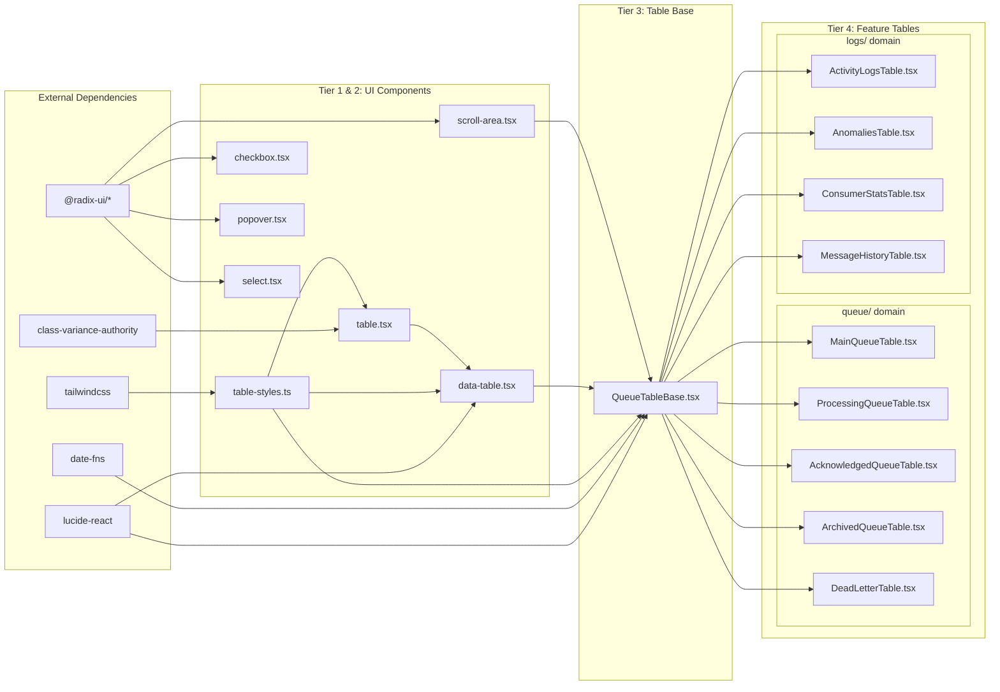

# Table Component Architecture

This document describes the table component structure and dependencies in the dashboard-ui.

## 4-Tier Architecture

The table system follows a strict 4-tier dependency hierarchy:

| Tier | Layer | Purpose |
|------|-------|---------|
| 1 | UI Primitives | Raw HTML table elements (`table.tsx`) |
| 2 | Data Table | Generic table features - sorting, pagination, virtualization (`data-table.tsx`) |
| 3 | Table Base | Domain-specific shared components - cells, tooltips, filters (`QueueTableBase.tsx`) |
| 4 | Feature Tables | Actual table implementations organized by domain |

**Import Rule:** Each tier may only import from the tier directly above it. Feature tables (Tier 4) must import exclusively from `QueueTableBase.tsx`.

## Component Hierarchy

```mermaid
flowchart TB
    subgraph "Tier 1: UI Primitives"
        table.tsx["table.tsx"]
        table.tsx --> Table
        table.tsx --> TableHeader
        table.tsx --> TableBody
        table.tsx --> TableRow
        table.tsx --> TableHead
        table.tsx --> TableCell
    end

    subgraph "Tier 2: Data Table"
        data-table.tsx["data-table.tsx"]
        data-table.tsx --> DataTable
        data-table.tsx --> SortableHeader
        data-table.tsx --> PaginationFooter
        data-table.tsx --> EmptyState
        data-table.tsx --> useVirtualization
        data-table.tsx --> useElementHeight
    end

    subgraph "Tier 3: Table Base"
        QueueTableBase.tsx["QueueTableBase.tsx"]
        QueueTableBase.tsx --> SelectCell
        QueueTableBase.tsx --> IdCell
        QueueTableBase.tsx --> TypeCell
        QueueTableBase.tsx --> PayloadCell
        QueueTableBase.tsx --> TimeCell
        QueueTableBase.tsx --> ActionsCell
        QueueTableBase.tsx --> HighlightableTableRow
        QueueTableBase.tsx --> useTableVirtualization
        QueueTableBase.tsx --> useCursorTooltip
        QueueTableBase.tsx --> LoadingOverlay
        QueueTableBase.tsx --> FilterPopover
        QueueTableBase.tsx --> TableContainer
        QueueTableBase.tsx --> SummaryFooter
        QueueTableBase.tsx --> CopyableIdCell
    end

    subgraph "Tier 4: Feature Tables"
        subgraph "queue/ folder"
            MainQueueTable
            ProcessingQueueTable
            AcknowledgedQueueTable
            ArchivedQueueTable
            DeadLetterTable
        end
        subgraph "logs/ folder"
            ActivityLogsTable
            AnomaliesTable
            ConsumerStatsTable
            MessageHistoryTable
        end
    end

    table.tsx --> data-table.tsx
    data-table.tsx --> QueueTableBase.tsx
    QueueTableBase.tsx --> MainQueueTable
    QueueTableBase.tsx --> ProcessingQueueTable
    QueueTableBase.tsx --> AcknowledgedQueueTable
    QueueTableBase.tsx --> ArchivedQueueTable
    QueueTableBase.tsx --> DeadLetterTable
    QueueTableBase.tsx --> ActivityLogsTable
    QueueTableBase.tsx --> AnomaliesTable
    QueueTableBase.tsx --> ConsumerStatsTable
    QueueTableBase.tsx --> MessageHistoryTable
```



## Import Dependencies



## File Structure

```
dashboard-ui/src/components/
├── ui/                              # Tier 1 & 2
│   ├── table.tsx                    # Tier 1: Base HTML table elements
│   ├── data-table.tsx               # Tier 2: Sorting, pagination, virtualization
│   ├── table-styles.ts              # Centralized Tailwind style constants
│   ├── scroll-area.tsx              # Custom scroll container
│   ├── checkbox.tsx                 # Radix checkbox wrapper
│   ├── popover.tsx                  # Radix popover wrapper
│   └── select.tsx                   # Radix select wrapper
│
├── queue/                           # Tier 3 + Tier 4 (queue domain)
│   ├── QueueTableBase.tsx           # Tier 3: Shared cells, rows, hooks, utilities
│   ├── MainQueueTable.tsx           # Tier 4: Queued messages view
│   ├── ProcessingQueueTable.tsx     # Tier 4: Active messages view
│   ├── AcknowledgedQueueTable.tsx   # Tier 4: Acknowledged messages view
│   ├── ArchivedQueueTable.tsx       # Tier 4: Archived messages view
│   ├── DeadLetterTable.tsx          # Tier 4: Failed messages view
│   ├── useQueueMessages.ts          # Queue data fetching hook
│   └── types.ts                     # Queue type definitions
│
└── logs/                            # Tier 4 (logs domain)
    ├── ActivityLogsTable.tsx        # Tier 4: Message lifecycle events
    ├── AnomaliesTable.tsx           # Tier 4: Detected anomalies
    ├── ConsumerStatsTable.tsx       # Tier 4: Per-consumer statistics
    └── MessageHistoryTable.tsx      # Tier 4: Single message history
```

**Note:** The `queue/` and `logs/` folders represent domain organization, not architectural tiers. All feature tables (Tier 4) are at the same dependency level - they import exclusively from `QueueTableBase.tsx`.

## Key Dependencies

| Package | Purpose |
|---------|---------|
| `@radix-ui/react-checkbox` | Checkbox primitives |
| `@radix-ui/react-popover` | Filter popovers |
| `@radix-ui/react-scroll-area` | Custom scrollbars |
| `@radix-ui/react-select` | Dropdown selects |
| `@radix-ui/react-tooltip` | Tooltips |
| `lucide-react` | Icons |
| `tailwindcss` | Styling framework |
| `class-variance-authority` | CSS class composition |
| `tailwind-merge` | Tailwind class merging |
| `date-fns` | Date formatting |

## Shared Components (QueueTableBase.tsx)

### Cell Components
- `SelectCell` - Row selection checkbox
- `IdCell` - Message ID with copy button (for message contexts)
- `CopyableIdCell` - Generic ID with copy button (for non-message contexts)
- `TypeCell` - Message type badge
- `PayloadCell` - Truncated payload with expand and optional toast message
- `TimeCell` - Formatted timestamps
- `ActionsCell` - Action buttons (ack, nack, delete)
- `PriorityCell` - Priority badge
- `AttemptCell` - Attempt count display

### Row Components
- `HighlightableTableRow` - Row with highlight/selection/critical states
- `TableWrapper` - Scroll area wrapper
- `EmptyTableBody` - Empty state for tables

### Utility Components
- `LoadingOverlay` - Full-screen loading spinner overlay
- `FilterPopover` - Reusable filter popover with header, clear button, and content slot
- `TableContainer` - Container with loading state and footer slot
- `SummaryFooter` - Footer for displaying summary statistics with colored indicators
- `CursorTooltip` - Tooltip that follows the cursor position

### Hooks
- `useTableVirtualization` - Virtualization setup for large lists
- `useCursorTooltip` - Mouse position tracking for tooltips

## Features

| Feature | Implementation |
|---------|---------------|
| Virtualization | Custom hook, triggers at 100+ rows |
| Pagination | Configurable page sizes (100-1000) |
| Sorting | Clickable headers with direction indicators |
| Filtering | Popover-based filters per table (via FilterPopover) |
| Selection | Checkbox with shift-click range support |
| Highlighting | Temporary animation on row updates |
| Loading States | LoadingOverlay component with backdrop blur |
| Summary Footers | SummaryFooter with colored stat indicators |

## Component Reuse Patterns

### LoadingOverlay
Used across all tables to show a loading state:
```tsx
import { LoadingOverlay } from "@/components/queue/QueueTableBase"

{loading && <LoadingOverlay />}
```

### FilterPopover
Provides consistent filter UI across tables:
```tsx
import { FilterPopover } from "@/components/queue/QueueTableBase"

<FilterPopover
    isOpen={filterOpen}
    onOpenChange={setFilterOpen}
    isFilterActive={isFilterActive}
    onClearFilters={handleClearFilters}
    title="Filters"
>
    {/* Filter fields go here */}
</FilterPopover>
```

### SummaryFooter
Displays summary statistics with optional colored indicators:
```tsx
import { SummaryFooter } from "@/components/queue/QueueTableBase"

<SummaryFooter
    items={[
        { label: "Total", value: 100 },
        { label: "Critical", value: 5, color: "bg-destructive" },
        { label: "Warning", value: 10, color: "bg-amber-500" }
    ]}
    rightContent={<span>Additional info</span>}
/>
```

### CopyableIdCell
Displays a truncated ID with copy button:
```tsx
import { CopyableIdCell } from "@/components/queue/QueueTableBase"

<CopyableIdCell id={item.id} truncateLength={10} />
```

### PayloadCell
Displays truncated payload with hover preview and copy button:
```tsx
import { PayloadCell } from "@/components/queue/QueueTableBase"

<PayloadCell
    payload={item.payload}
    toastMessage="Payload copied to clipboard"
/>
```
