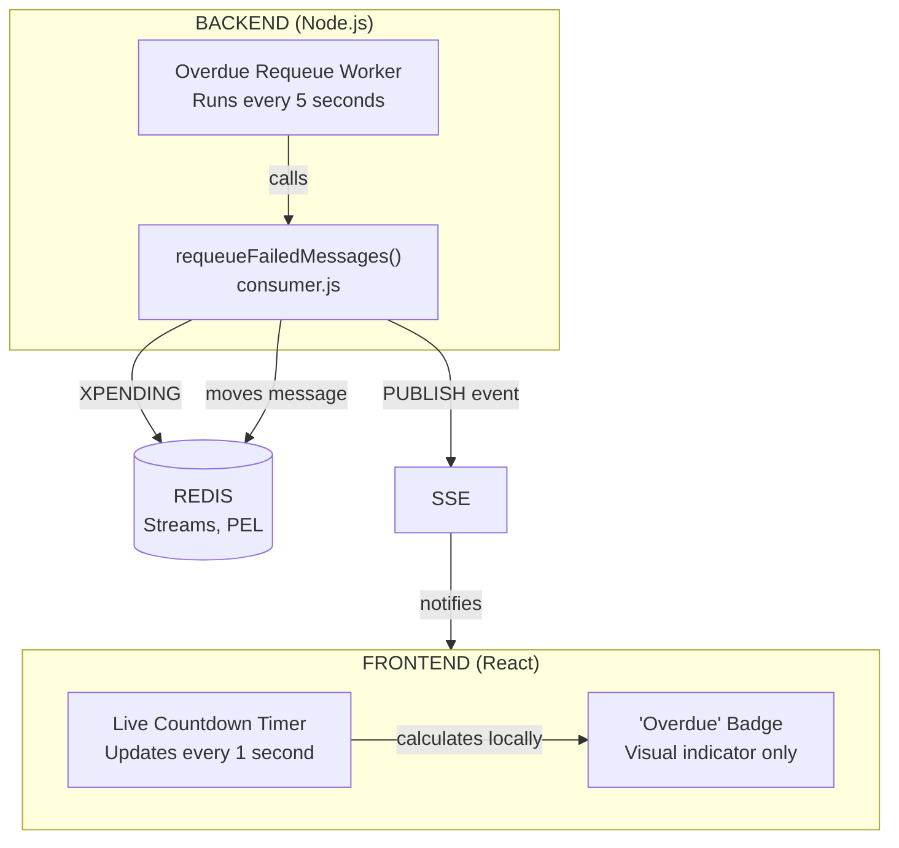
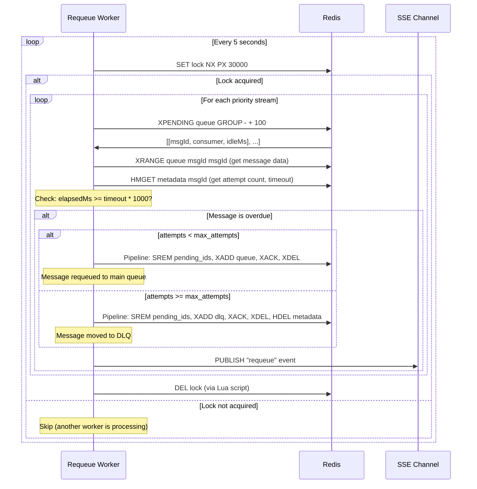
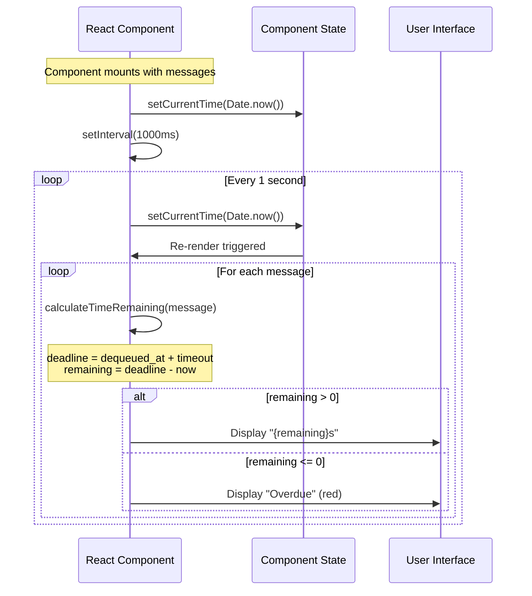

# Overdue Message Requeue Process

This document explains how messages that timeout in the processing queue get automatically requeued back to the main queue, and how the dashboard displays the countdown timer.

## Overview

When a consumer dequeues a message, it enters the "processing" state (Redis Pending Entry List). If the consumer doesn't ACK or NACK within the timeout period, the message is considered "overdue" and gets automatically requeued.

**Key Components:**
1. **Backend Worker** - Server-side process that detects and requeues overdue messages
2. **Frontend Timer** - Client-side countdown display (visual only, doesn't move messages)

## Architecture



## Backend: Overdue Requeue Worker

### Worker Startup

The worker starts when the server boots in [src/index.ts](../src/index.ts):

```javascript
const startOverdueRequeueWorker = () => {
  const overdueCheckIntervalMs = env.OVERDUE_CHECK_INTERVAL_MS;

  const tick = async () => {
    try {
      await queue.requeueFailedMessages();
    } catch (error) {
      logger.error({ err: error }, "Overdue requeue worker failed");
    }

    // Schedule next tick
    const nextTick = setTimeout(tick, overdueCheckIntervalMs);
    nextTick.unref?.();
  };

  tick();
  logger.info(`Overdue requeue worker started (interval=${overdueCheckIntervalMs}ms)`);
};
```

**Key Characteristics:**
| Property | Value |
|----------|-------|
| Polling Interval | Configurable via `OVERDUE_CHECK_INTERVAL_MS` (default: 5000ms) |
| Concurrency Control | Distributed lock prevents multiple workers |
| Lock TTL | 30 seconds |

### The `requeueFailedMessages()` Function

Located in [src/lib/queue/consumer.js](../src/lib/queue/consumer.js), this function:

1. Acquires a distributed lock (prevents race conditions in multi-instance deployments)
2. Scans all priority streams for pending messages
3. Checks each message's elapsed time against its timeout
4. Either requeues or moves to DLQ based on attempt count

### Detection Flow



### Timeout Calculation

The worker determines if a message is overdue using this logic:

```javascript
// Get timeout (per-message or default)
let effectiveTimeout = this.config.ack_timeout_seconds;  // Default: 30s
if (metadata.custom_ack_timeout) {
  effectiveTimeout = metadata.custom_ack_timeout;
}

// Calculate elapsed time
let elapsedMs = idleMs;  // From XPENDING
if (metadata && typeof metadata.dequeued_at === 'number') {
  // Use dequeued_at if available (more accurate, updated by TOUCH)
  elapsedMs = (currentTime - metadata.dequeued_at) * 1000;
}

// Check if overdue
if (elapsedMs < effectiveTimeout * 1000) continue;  // Not overdue yet
```

### Requeue vs DLQ Decision

```javascript
if (metadata.attempt_count >= effectiveMaxAttempts) {
  // Move to Dead Letter Queue
  messageData.failed_at = currentTime;
  messageData.last_error = "Max attempts exceeded (Stream)";
  pipeline.xadd(dead_letter_queue, "*", "data", messageJson);
} else {
  // Requeue to main queue (same priority stream)
  pipeline.xadd(queueName, "*", "data", messageJson);
}
```

### Redis Operations (Pipeline)

For each overdue message, these operations run atomically:

**Requeue Case:**
```
SREM queue:pending_ids messageId     # Remove from pending set
XADD queue_p5 * data {message}       # Add back to priority stream
XACK queue_p5 consumer-group msgId   # Acknowledge (remove from PEL)
XDEL queue_p5 msgId                  # Delete old entry
```

**DLQ Case:**
```
SREM queue:pending_ids messageId     # Remove from pending set
XADD queue_dlq * data {message}      # Add to DLQ
XACK queue_p5 consumer-group msgId   # Acknowledge
XDEL queue_p5 msgId                  # Delete old entry
HDEL queue:metadata messageId        # Clean up metadata
```

---

## Frontend: Countdown Timer

### How the Timer Works

The countdown is implemented in [ProcessingQueueTable.tsx](../dashboard-ui/src/components/queue/ProcessingQueueTable.tsx):

```tsx
// State for current time (updates every second)
const [currentTime, setCurrentTime] = useState(Date.now())

// Update timer every second when there are messages
useEffect(() => {
  if (messages.length === 0) return

  setCurrentTime(Date.now())
  const interval = setInterval(() => {
    setCurrentTime(Date.now())
  }, 1000)

  return () => clearInterval(interval)
}, [messages.length])
```

### Calculating Time Remaining

```tsx
const calculateTimeRemaining = useCallback((m: Message) => {
  const startTime = m.dequeued_at || m.processing_started_at
  if (!startTime) return <span className="text-muted-foreground italic">—</span>

  if (!config) return <span className="text-muted-foreground">...</span>

  const now = currentTime / 1000
  const timeoutSeconds = m.custom_ack_timeout || config.ack_timeout_seconds
  const deadline = startTime + timeoutSeconds
  const remaining = deadline - now

  if (remaining <= 0) {
    return <span className="text-destructive font-medium">Overdue</span>
  }

  return <span className="text-primary font-mono">{Math.ceil(remaining)}s</span>
}, [config, currentTime])
```

### Visual Flow



---

## Timeline: Frontend vs Backend

```
Time (seconds)    Frontend Display    Backend Action
─────────────────────────────────────────────────────
0                 "30s"               -
5                 "25s"               Worker tick (message not overdue)
10                "20s"               Worker tick (message not overdue)
15                "15s"               Worker tick (message not overdue)
20                "10s"               Worker tick (message not overdue)
25                "5s"                Worker tick (message not overdue)
30                "Overdue"           Worker tick (message not overdue yet*)
31                "Overdue"           -
32                "Overdue"           -
33                "Overdue"           -
34                "Overdue"           -
35                "Overdue"           Worker tick → MESSAGE REQUEUED ✓

* The worker checks idleMs from XPENDING which may have slight timing differences
```

**Important:** There can be up to ~5 seconds delay between the frontend showing "Overdue" and the backend actually requeuing the message. This is because:
1. Frontend updates every 1 second (real-time)
2. Backend worker polls every 5 seconds (batch process)

---

## Configuration

### Environment Variables

| Variable | Default | Description |
|----------|---------|-------------|
| `ACK_TIMEOUT_SECONDS` | 30 | Default timeout before message is overdue |
| `MAX_ATTEMPTS` | 3 | Attempts before moving to DLQ |
| `REQUEUE_BATCH_SIZE` | 100 | Max messages to process per worker tick |
| `OVERDUE_CHECK_INTERVAL_MS` | 5000 | How often the worker checks for overdue messages (in milliseconds) |

### Per-Message Overrides

Messages can specify custom timeouts:
```json
{
  "id": "msg_123",
  "payload": {...},
  "custom_ack_timeout": 60,
  "custom_max_attempts": 5
}
```

---

## Distributed Lock

To prevent race conditions when running multiple server instances:

```javascript
// Acquire lock
const lockKey = `${queue_name}:overdue_requeue_lock`;
const lockToken = generateId();
const lockOk = await redis.set(lockKey, lockToken, "NX", "PX", 30000);
if (!lockOk) return 0;  // Another instance has the lock

// ... process messages ...

// Release lock (only if we still own it)
await redis.eval(
  "if redis.call('GET', KEYS[1]) == ARGV[1] then return redis.call('DEL', KEYS[1]) else return 0 end",
  1,
  lockKey,
  lockToken
);
```

---

## Events Published

When messages are requeued or moved to DLQ, SSE events notify the dashboard:

**Requeue Event:**
```json
{
  "type": "requeue",
  "timestamp": 1704067200000,
  "payload": {
    "count": 3,
    "dlq_count": 0,
    "triggered_by": "scheduler"
  }
}
```

**Move to DLQ Event:**
```json
{
  "type": "move_to_dlq",
  "timestamp": 1704067200000,
  "payload": {
    "count": 1
  }
}
```

The dashboard listens for these events and refreshes the queue data accordingly.

---

## Summary

| Aspect | Frontend | Backend |
|--------|----------|---------|
| **Purpose** | Visual countdown display | Actually moves messages |
| **Update Frequency** | Every 1 second | Every 5 seconds |
| **Data Source** | `message.dequeued_at` + `config.ack_timeout_seconds` | `XPENDING` idle time + metadata |
| **Action on Overdue** | Shows "Overdue" badge (red) | Requeues message or moves to DLQ |
| **Latency** | Immediate | Up to 5 seconds |

The frontend provides real-time visual feedback, while the backend handles the actual message lifecycle management with distributed locking for consistency.
